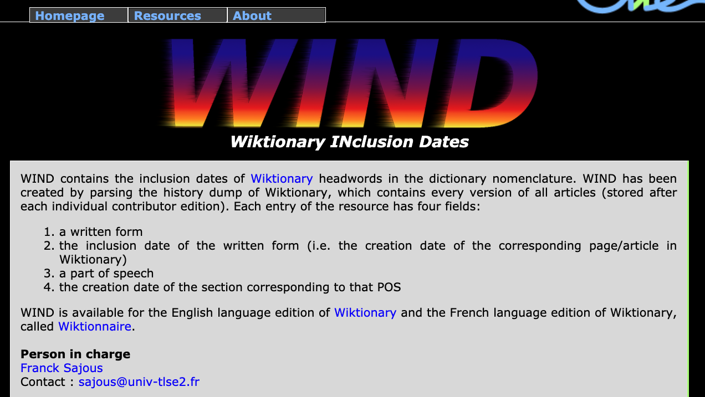
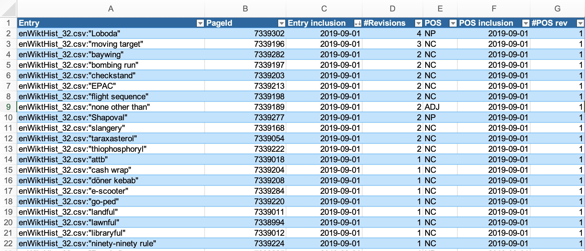

::: {.content-hidden when-format="revealjs"}
[Open slides version](slides.html){.btn .btn-primary}
:::

# Introduction

## Recap

- Revisited why lexicology treats the lexicon as a **structured network**, not a flat list, using mental lexicon evidence and embedding demos.
- Distinguished **dictionary functions** (descriptive vs prescriptive), sense-ordering strategies, and usage labels that mediate interpretation.
- Practised translating OED search output into **research questions** on word classes, formation processes, and semantic domains.
- Walked through **OED workflows**: extracting post-2000 neologisms, exporting CSV data, and analysing them with tables and pivot charts.

::: {.notes}
- 10:15–10:20 — Welcome back + recap of Session 04 (catch-up period: 10:15–10:45)
:::

## Outline

1. Map the landscape of **dictionary types** (general, bilingual, specialised, diachronic vs synchronic).
2. Evaluate **crowdsourced vs curated** platforms (Urban Dictionary, Wiktionary, OED) and their affordances.
3. Explore **machine-readable resources** (WIND) and spreadsheet workflows for lexicological analysis.
4. Run a **hands-on comparison** of dictionary entries to surface researchable contrasts.
5. Connect dictionary outputs to **linguistic research applications** (historical, comparative, contemporary, methodological).

::: {.notes}
- 10:20–10:22 — Frame session goals and transitions
:::

# Types of Dictionaries

## General Purpose Dictionaries

- Provide **comprehensive** linguistic information about words in a single language
    - Spelling, pronunciation, and grammatical classification
    - Multiple meanings and contextual usage examples
    - Etymology and historical development notes
- Typically **monolingual** and organised alphabetically for easy reference
- Valuable for **morphological research** because they:
    - Document detailed word origins and development
    - Show common usage patterns and variations
    - Provide historical context for word formation

::: {.notes}
- 10:45–10:47 — Dictionary types overview (new content begins)
:::

## Bilingual and Multilingual Dictionaries

- Facilitate **translation** between two or more languages
- Key features and functions:
    - Support language learning and translation work
    - Help decode meanings across different languages
    - Illustrate cultural and linguistic nuances
- Important for morphological research by:
    - Enabling **cross-linguistic** word formation studies
    - Revealing patterns in **comparative linguistics**
    - Showing how concepts transfer between languages

::: {.notes}
- 10:47–10:48
:::

## Specialized Dictionaries

- Focus on **specific aspects** of language or technical fields:
    - Etymology and word origins
    - Precise pronunciation guides
    - Technical and discipline-specific terminology
    - Slang and colloquial expressions
- Particularly valuable for:
    - Detailed **academic research** in specific fields
    - Understanding technical vocabulary development
    - Tracing specialised word formation patterns

::: {.notes}
- 10:48–10:49
:::

## Diachronic and Synchronic Dictionaries

- **Diachronic** dictionaries:
    - Track how words change **through history**
    - Document evolution of meanings and forms
- **Synchronic** dictionaries:
    - Focus on language at **specific points in time**
    - Present contemporary usage and meanings
    - Document current word formation patterns
- Essential tools for:
    - **Historical linguistic research**
    - Understanding language evolution
    - Tracking word formation changes over time

::: {.notes}
- 10:49–10:50
:::

## Learner's Dictionaries

::: {.small}
- Specifically designed for **language acquisition**:
    - Clear, simplified definitions
    - Practical, everyday usage examples
    - Word frequency information
    - Common collocations and phrases
- Additional features often include:
    - Grammar notes and usage guidelines
    - Cultural context explanations
    - Learning exercises and examples
- Useful for research into:
    - Common **word usage patterns**
    - Language acquisition processes
    - Basic word formation principles
:::

::: {.notes}
- 10:50–10:51
:::

# Specific Examples of Dictionaries

::: {.notes}
- 10:51–10:52 — Transition to specific examples
:::

## Oxford English Dictionary (OED)

::: {.small}
- Official website: <https://www.oed.com/>
- Comprehensive **historical dictionary** of English by Oxford University Press
- Considered the **authoritative source** on English language
- Key features:
    - **Historical approach**: traces word development chronologically
    - **Extensive quotations**: over 3 million citations from wide-ranging sources
    - **Comprehensive coverage**: 600,000+ words and phrases across 20 volumes
    - Online since 2000; third edition in progress (electronic-only)
- Value for research:
    - Traces detailed development of word forms and meanings
    - Provides extensive historical context and usage patterns
    - Enables in-depth **morphological analysis**
    - Documents linguistic patterns and changes over time
:::

::: {.notes}
- 10:52–10:53 — OED overview
:::

## Wiktionary

- Official website: <https://www.wiktionary.org/>
- Multilingual, web-based **collaborative dictionary**
- Key features:
    - **Crowdsourced content** with rapid updates
    - Comprehensive and flexible entries for new words
    - Multiple language support with cross-references
    - Detailed etymological information where available
- Research applications:
    - **Neologism** and language evolution studies
    - **Cross-linguistic research** opportunities
    - Contemporary usage patterns
    - Educational tool for language learning and research

::: {.notes}
- 10:53–10:54
:::

---

### WIND (Machine-readable Wiktionary)

@Sajous2020ENGLAWI

<http://redac.univ-tlse2.fr/lexiques/wind.html>

{width="450"}

---

[Excel Sheet](https://1drv.ms/x/c/9a2ec97d593520f9/IQD5IDVZfckuIICaZxEAAAAAARb8555fyrlCaa947C97Owg)

::: {.notes}
- 10:54–10:55
:::

## Urban Dictionary

- Official website: <https://www.urbandictionary.com/>
- **Crowdsourced dictionary** focusing on **slang** and **colloquial language**
- Key features:
    - **User-generated content** reflecting varied interpretations
    - Dynamic tracking of language evolution
    - Rich cultural context and references
    - Multiple definitions showing usage variations
- Research value:
    - **Sociolinguistic studies** of contemporary language
    - Tracking emergence and spread of new slang
    - Cultural analysis through language use
    - Understanding informal **word formation processes**

::: {.notes}
- 10:55–10:56
:::

## Other Major Dictionaries

**Merriam-Webster Dictionary** (<https://www.merriam-webster.com/>)

- **American English** focus
- Strong etymology coverage
- Regular updates for contemporary usage
- Valuable for understanding American English word formation

**Collins English Dictionary** (<https://dictionary.cambridge.org/>)

- Comprehensive vocabulary coverage
- Strong **British English** focus
- Detailed word formation information
- Includes frequency information and usage trends

---

**Cambridge English Dictionary** (<https://dictionary.cambridge.org/>)

- Clear definitions and examples
- Strong **learner focus**
- British English emphasis
- Excellent grammatical information and usage notes

**Online Etymology Dictionary** (<https://www.etymonline.com/>)

- Detailed **word history** tracking
- **Etymology** focus
- Historical development emphasis
- Traces morphological changes over time

::: {.notes}
- 10:56–11:00 — Other major dictionaries
- BREAK — announce 5‑minute break at 11:00; resume 11:05
:::

# Applications in Linguistic Research

## Historical linguistic analysis

- Tracking **morphological changes** through time
    - e.g. comparing Old English strong verbs to Modern English irregular forms
- Understanding **semantic development**
    - e.g. charting the shift of *awful* from 'full of awe' to 'terrible'
- Documenting **word formation patterns**
    - e.g. analyzing the emergence of the prefix *cyber-* in late 20th century

::: {.notes}
- AFTER BREAK — resume at 11:05
- 11:05–11:08
:::

## Comparative linguistics

- **Cross-linguistic** word formation studies
    - e.g. comparing German and English compound nouns (e.g. de. *Zahnarzt* vs en. *tooth doctor*)
- Analysis of **borrowing patterns**
    - e.g. tracing French loanwords (e.g. *cuisine*, *ballet*) into English after the Norman Conquest
- Understanding **morphological universals**
    - e.g. investigating prefixation productivity across unrelated languages (e.g. *ge-* in German, *en-* in English)

::: {.notes}
- 11:08–11:10
:::

## Contemporary language research

- **Neologism** studies and word creation
    - e.g. investigating the rise of *selfie* and *meme* via social media corpora
- **Sociolinguistic variation**
    - e.g. examining morphological variation in teenage text messaging (e.g. abbreviations like *u* for you)
- **Internet-influenced** language change
    - e.g. analyzing adoption of acronyms (e.g. *lol*, *brb*) in spoken and written registers

::: {.notes}
- 11:10–11:12
:::

## Methodological applications

- **Diachronic studies** of word formation
    - e.g. comparing *selfie* definitions in 2013 vs 2025 corpora to trace shifts from novelty to mainstream usage
- **Quantitative analysis** of lexical change over time
    - e.g. measuring the rise of *cryptocurrency* entries over time
- **Corpus-based validation** of dictionary entries
    - e.g. using the *Corpus of Contemporary American English* to test whether dictionary data match corpus data
- Tracking the adoption of **loanwords** and **neologisms**
    - e.g. tracing how *hygge* transitions from Danish loanword to standard entry in learner dictionaries

---

- Identifying gaps or biases in dictionary coverage
    - e.g. noticing that everyday items like *takeaway* are absent from learner dictionaries
- Supporting **computational linguistics** and NLP tasks (e.g. lemmatisation, part-of-speech tagging)
    - e.g. expanding sentiment lexicons with blended forms like *hangry*
- Informing the design of new dictionaries and lexical resources
    - e.g. designing a climate change glossary after analysing coverage gaps for items like *carbon offsetting*

::: {.notes}
- 11:12–11:18
:::

# Practice: analysing and comparing dictionary entries

- Choose at least two terms that might be interesting for comparison.
- Look them up in $\geq$ 2 dictionaries from $\geq$ 2 different dictionary types.
- Analyse and compare the entries between the dictionaries.
- Can you think of related research questions?
- Prepare slides in [this PowerPoint file](https://1drv.ms/p/c/9a2ec97d593520f9/IQAPYwC-Z-mTSKIXPC2M-s87AaVTUjFevdwiVV7FhmJeYjE).
- Present your findings to the class.

::: {.notes}
- 11:18–11:25 — Practice activity introduction
:::

# Practise using the OED

## Analysis objectives

1. How many terms are marked as ***obsolete*** across the whole OED?
2. What are the most common **word classes** of obsolete terms?
3. What are the most common **word-formation processes**?
4. What are the most common **subjects**?

## Using the OED's Advanced Search

- find all terms that are marked as ***obsolete***
- sort them by `Date (newest first)`
- export the results as a **CSV file**

## Using Microsoft Excel

1. open the **CSV file**
2. save the file as an Excel file (`.xlsx` extension)
3. convert the exported rows/columns to a `Table`
4. create **`Pivot Table`s** to analyse the data
5. create **`Pivot Chart`s** to visualise the data

[Model Excel file](https://1drv.ms/x/c/9a2ec97d593520f9/EaLL88w43gZCrHEXDYO5Qa0BRPZiuRcROamaxi4AJhFTsg)

::: {.notes}
- 11:25–11:30 — OED practice
:::

# Summary

- **Dictionaries are not monolithic.** Different types — general, specialised, bilingual, diachronic—serve different purposes.
- **Choose the right tool for the job.** The best dictionary for your research depends on your specific questions (e.g., historical development, contemporary slang, cross-linguistic comparison).
- **Dictionaries are data.** They are curated datasets that can be used for qualitative and quantitative linguistic analysis, revealing patterns in word formation, semantic change, and language use.

::: {.notes}
- 11:30–11:45 — Wrap-up and summary
:::

# References

:::: {#refs}
::::