::: {.content-hidden when-format="revealjs"}
[Open slides version](slides.html){.btn .btn-primary}
:::

# Outline

- [Discussion of study questions](#discussion-notes) — Q1–Q7 on @Hilpert2023Meaning
- [Theoretical framework](#theoretical-framework) — Quick review: Principle of No Synonymy, Distributional Hypothesis
- [COCA study overview](#studying-the-meaning-of-clippings-in-the-coca) — Data, method, and results
- [Practice using Sketch Engine](#practice-studying-meanings-using-sketch-engine) — Analyse clipping pairs using collocations and word sketches

::: {.notes}
- 10:15–10:17
:::

# Preparatory reading: @Hilpert2023Meaning

## Study questions {.small}

Please read the paper and prepare answers to these questions for our class discussion:

1. What is the Principle of No Synonymy, and what does it predict about clippings and their source words?
2. How do the authors use the principle "You shall know a word by the company it keeps" [@Firth1957SynopsisLinguistic] to study meaning differences? What do they compare?
3. What does the paper find about clippings in "involved" vs. "informational" contexts? Which linguistic features distinguish them?
4. Some clippings (e.g., *fridge*/*refrigerator*) are nearly synonymous, while others (e.g., *cardio*/*cardiovascular*) show clear differences. What factors might explain this variation?
5. How can collocation analysis reveal semantic differences not obvious from intuition? Use an example from the paper.
6. Choose one pair from Table 1 (e.g., *exam*/*examination*). What differences might you expect, and what would you look for in a corpus analysis?
7. The paper offers two explanations for clippings in "involved" contexts: familiarity vs. efficiency. What evidence supports each? Which do you find more convincing?

## Q1: Principle of No Synonymy

What is the Principle of No Synonymy, and what does it predict about clippings and their source words?

::: {.incremental}
- **Definition**: A difference in linguistic form always indicates a difference in meaning.
- **Broad notion of "meaning"**: semantic content, but also discourse-functional, interpersonal, and information-structural aspects.
- **Prediction for clippings**: clippings and source words should have distinct distributional characteristics that reflect functional differences.
:::

::: {.notes}
- Key theoretical foundation of the paper
- The authors adopt a usage-based perspective: language use shapes and reflects speakers' knowledge
- One view: clippings don't change meaning "as a matter of principle"
- But even if referential meaning is identical, connotations/register may differ (*lab* expresses familiarity)
:::

. . .

**Example**: *brother* (kinship term) vs *bro* (address term for close friend within specific communities) — clearly distinct meanings despite shared etymology.

::: {.notes}
- 10:17–10:22
- Follow-up: Can students think of other clipping pairs where the meaning has clearly diverged?
:::

## Q2: Distributional Hypothesis

::: {.notes}
- 10:22–10:27
- Example: *cardiovascular* and *hypertension* share collocates like *heart*, *disease*, *diabetes*, *stroke*
- The aggregate comparison looks at features of involved vs informational text production
- The individual comparison uses semantic vector space modeling with second-order collocates
- **Core idea**: The meaning of words is reflected in their contextual elements in language use.
- Words appearing in similar contexts share aspects of their meanings.
- **Method**: Compare collocational profiles of clippings vs source words.
:::

How do the authors use the principle "You shall know a word by the company it keeps" to study meaning differences? What do they compare?

. . .

**Two levels of comparison**:

::: {.incremental}
1. **Aggregate level**: frequency of "involved" vs "informational" markers across all 50 pairs (Table 2)
2. **Individual level**: token-based semantic vector spaces using second-order collocates
:::

::: {.notes}
- Second-order collocates: not just what appears next to the word, but what appears next to *those* words
- This enriches sparse concordance data and reveals deeper semantic relationships
- Follow-up: Why might second-order collocates be more revealing than first-order collocates?
:::

## Q3: Involved vs Informational Contexts {.small}

What does the paper find about clippings in "involved" vs "informational" contexts? Which linguistic features distinguish them?

The paper tests 12 markers of involved vs informational text production.

. . .

::: {.columns}
:::: {.column width="50%"}
**Involved markers** (more frequent with clippings):

- Private verbs (*know*, *think*, *believe*)
- Contractions (*it's*, *you're*)
- Present tense verbs
- 1st and 2nd person pronouns (*I*, *you*)
- Indefinite pronouns (*something*, *anyone*)
- Pronoun *it*
::::
:::: {.column width="50%"}
**Informational markers** (more frequent with source words):

- Complementiser *that*
- Common nouns
- Prepositions
::::
:::

::: {.notes}
- 10:27–10:32
- 10 of 12 features showed significant differences (Table 3)
- Non-significant: demonstrative pronouns, type-token ratio
- This supports the idea that clippings signal familiarity and appear where there's common ground between speaker and hearer
- Involved text = interpersonal, affective, high speaker involvement
- Informational text = detached, high information density
- Figure 1 and 2 show boxplots for all 12 features
- Follow-up: Why might demonstrative pronouns not show the expected pattern?
:::

## Q4: Variation in Synonymy

Some clippings (e.g., *fridge*/*refrigerator*) are nearly synonymous, while others (e.g., *cardio*/*cardiovascular*) show clear differences. What factors might explain this variation?

. . .

**Clearly distinct pairs** (Figure 3):

::: {.small}
- *cardio*/*cardiovascular*: fitness vs medical contexts
- *chemo*/*chemotherapy*: patient experience vs technical medical
- *indie*/*independent*: underground culture vs general meaning
- *dorm*/*dormitory*: includes tourist lodging uses
:::

::: {.notes}
- Factors explaining variation:
  1. **Degree of lexicalisation**: has the clipping developed independent meanings over time?
  2. **Domain specificity**: technical terms may diverge more from everyday uses
  3. **Social/register associations**: some clippings tied to specific communities
  4. **Time depth**: longer-established clippings may have diverged more
- One might predict clippings undergo **semantic narrowing** to technical meanings
- But *cardio*, *chemo* show the opposite — they're BROADER and less technical than their source words
- *bro* is the clearest example of complete semantic divergence (no longer a kinship term)
:::

. . .

**Near-synonymous pairs** (Figure 4):

::: {.small}
- *fridge*/*refrigerator*: same semantic facets accessible to both
- *porn*/*pornography*: industry, psychological, legal aspects shared
:::

::: {.notes}
- 10:32–10:37
- Follow-up: Can students predict which pairs from Table 1 might be synonymous vs distinct?
:::

## Q5: Collocation Analysis

How can collocation analysis reveal semantic differences not obvious from intuition? Use an example from the paper.

. . .

**Example: *cardio* vs *cardiovascular***

Intuition might suggest they mean the same thing. But collocates reveal:

::: {layout="[50,50]"}
::: {.small}
***cardiovascular***:

- *disease*, *diabetes*, *chronic*
- *renal*, *kidney*, *liver*
- Medical/clinical contexts
:::

::: {.small}
***cardio***:

- *workout*, *fat-blasting*, *calendar*
- *recipes*, *oranges*, *dishes*
- Fitness/lifestyle contexts
:::
:::

::: {.notes}
- 10:37–10:42
- Table 4 shows second-order collocates for specific concordance lines
- The token-based semantic vector space method reveals these patterns systematically
- Other examples:
  - *exam* vs *examination*: the long form has a "journalistic investigation" sense (*a detailed examination of the inefficiencies*) that *exam* cannot express
  - *intro* vs *introduction*: *intro* can mean musical introduction; *introduction* used more broadly
  - *pic* vs *picture*: *pic* usually = photo; *picture* has wider range (also movie, representation, etc.)
- Key insight: corpus methods can reveal differences we might not notice through introspection
- Follow-up: Why might we miss these differences using only our intuition?
:::

## Q6: Corpus Analysis of *exam*/*examination* {.small}

Choose one pair from Table 1 (e.g., *exam*/*examination*). What differences might you expect, and what would you look for in a corpus analysis?

. . .

**Expected differences**:

::: {.incremental}
- *exam*: academic/medical test contexts, informal register
- *examination*: formal register, plus "investigation/scrutiny" sense
:::

::: {.notes}
- The paper found considerable overlap for this pair (Figure 4)
- But the "investigation" sense is exclusive to *examination*
- Examples from paper:
  - "a detailed examination of the inefficiencies of Soviet centralized decision-making"
  - "In-depth examination of why nations compete, cooperate, and sometimes go [to war]"
- *exam* would be unacceptable in these contexts
- This is a good example of partial synonymy with specific non-overlapping domains
:::

. . .

**What to look for in a corpus**:

::: {.incremental}
- **Collocates**: *final exam*, *take an exam* vs *detailed examination*, *close examination*, *under examination*
- **Text types**: spoken/informal (blog, fiction) vs written/formal (academic, news)
- **Modifiers**: different adjectives? (*tough exam* vs *thorough examination*)
- **Syntactic patterns**: *examination of* (investigation) vs *exam in/on* (subject)?
:::

::: {.notes}
- 10:42–10:47
- **Bridge to practice**: After the break, you'll do exactly this kind of analysis in Sketch Engine — choose a pair from Table 1 and investigate collocates/word sketches
- Follow-up: Other pairs from Table 1 students might analyse?
:::

## Q7: Familiarity vs Efficiency

The paper offers two explanations for clippings in "involved" contexts: familiarity vs efficiency. What evidence supports each? Which do you find more convincing?

. . .

**Familiarity explanation**:

::: {.small}
- Clippings signal common ground, shared expertise, in-group membership
- Evidence: co-occurrence with "involved" markers; personal experience contexts
- Example: *chemo* in patient narratives vs *chemotherapy* in medical papers
:::

::: {.notes}
- The authors favour the familiarity explanation for most cases
- Key argument: efficiency only applies when forms are truly synonymous
- If clippings and source words differ in meaning (as shown for many pairs), speakers choose based on meaning, not length
- For most clippings, semantic factors likely dominate
:::

. . .

**Efficiency explanation**:

::: {.small}
- Shorter forms preferred when predictable; saves processing effort
- Counter-evidence: predictability effects are limited when forms differ in meaning
:::

::: {.notes}
- 10:47–10:52
- But for truly synonymous pairs like *fridge*/*refrigerator*, efficiency might play a role
- Follow-up: Is this an either/or question, or could both factors operate?
- Discussion prompt: Students might discuss which explanation they find more compelling and why
:::

# Theoretical framework {#theoretical-framework}

## Does clipping involve a change in meaning?

One view: clippings and source words are alternatives that only differ in form, not meaning.

Examples:

- *mic* vs. *microphone*
- *lab* vs. *laboratory*
- *ad* vs. *advertisement*

. . .

**But**: do *brother* and *bro* have the same meaning?

::: {.notes}
- 10:52–10:54
- Quick run-through; already discussed in Q1
:::

## The Principle of No Synonymy

- A difference in linguistic form always indicates a difference in meaning [@Goldberg1995ConstructionsConstruction].
- "Meaning" is broad: semantic, discourse-functional, interpersonal, etc.
- **Prediction**: clippings and source words should have distinct distributions, reflecting functional differences.

. . .

::: {.callout-note}
Think of 3 sentences the words *brother* and *bro* could appear in.
:::

::: {.notes}
- 10:54–10:56
- Already covered in Q1; skip callout if short on time
:::

## The Distributional hypothesis

- The meaning of words is reflected in their contextual elements in language use: **"You shall know a word by the company it keeps" **[@Firth1957SynopsisLinguistic].
- Words that appear in similar contexts share aspects of their meanings.
- Example: *happy* and *joyful* share collocates like *very*, *feel*, *make*, *person*.

::: {.notes}
- 10:56–10:58
- Already covered in Q2
:::

---

### Cognitive-linguistic models of the lexicon

::: {layout="[40,60]"}

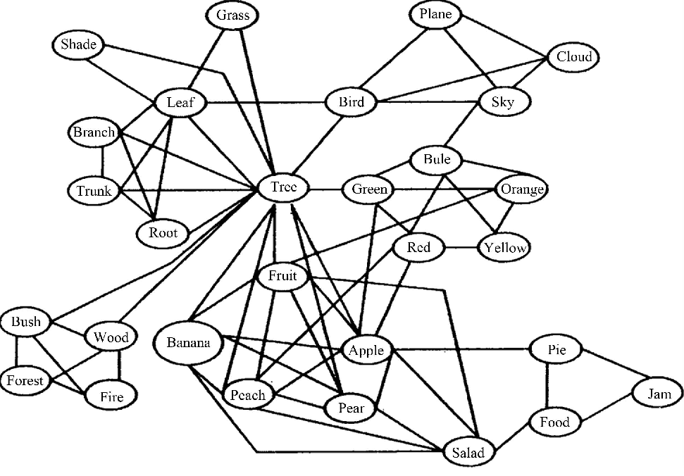
:::

::: {.notes}
- 10:56–10:58 (same as Distributional hypothesis)
- Quick visual; skip if short on time
:::

---

## Word embeddings [@Bandyopadhyay2022Interactive]

::: {layout="[50,50]"}
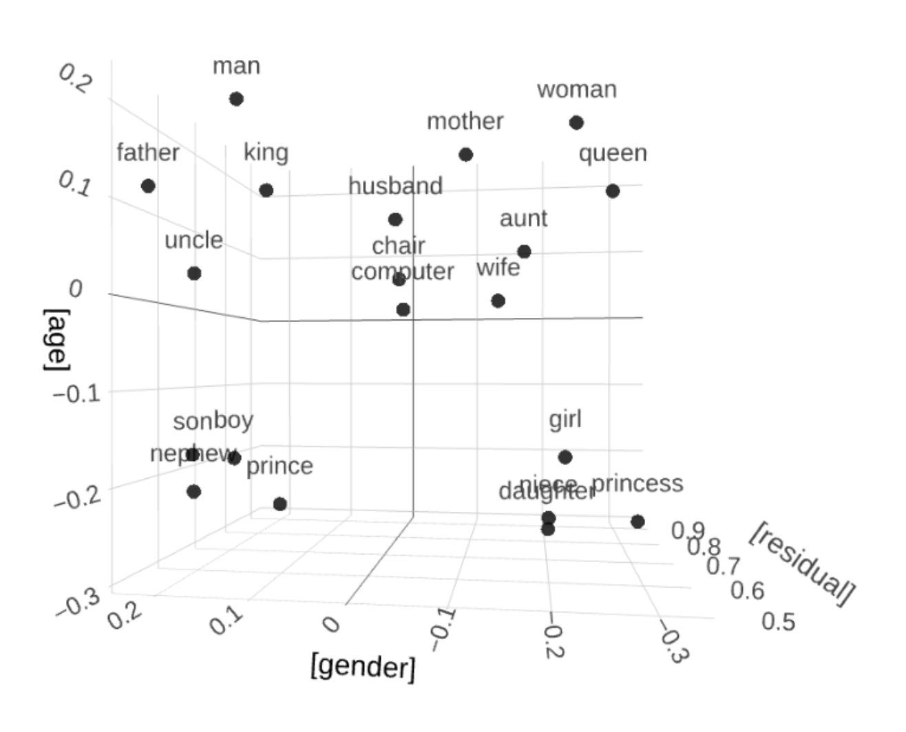{width="600"}

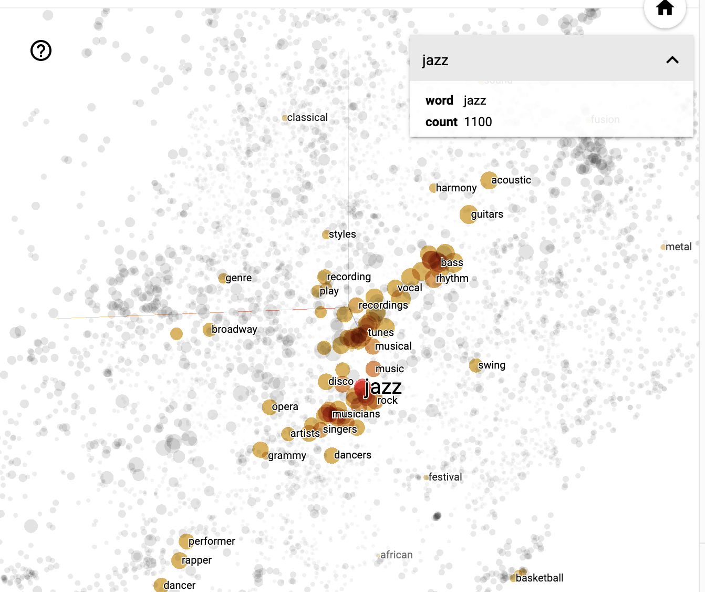{width="500"}
:::

::: {.notes}
- 10:56–10:58 (same slot)
- Skip or show briefly; exercise below is optional
:::

---

### Exercise

::: {.small}
[Word Embeddings Explorer](http://vectors.nlpl.eu/explore/embeddings/en/)

1. Explore synonyms and antonyms (Similar words)
    - Enter a seed word (e.g., `happy_ADJ`).
    - Inspect the 5 nearest neighbours.
    - Compare with an antonym (e.g., `sad_ADJ`).
2. Visualise semantic clusters (Visualization)
    - Choose two related groups (e.g., animals vs furniture).
    - Plot in vector space; describe visible groupings.
3. Word analogies (Calculator)
    - Try analogies, e.g., `male_ADJ : doctor_NOUN = female_ADJ : ?`.
    - Test several analogies; note successes and failures.
4. Investigate ambiguity
    - Pick a polysemous word (e.g., *bank*).
    - Analyse how neighbours reflect different senses.
:::

::: {.notes}
- SKIP — optional homework; mention briefly if time
- animals: `gorilla_NOUN,goat_NOUN,elephant_NOUN,cow_NOUN,dog_NOUN,hawk_NOUN,cat_NOUN,mouse_NOUN,baboon_NOUN,tiger_NOUN,fly_NOUN,hamster_NOUN`
- furniture: `dresser_NOUN,desk_NOUN,nightstand_NOUN,bookshelf_NOUN,sofa_NOUN,stool_NOUN,chair_NOUN,bed_NOUN,table_NOUN,armchair_NOUN,cabinet_NOUN,bench_NOUN,ottoman_NOUN,wardrobe_NOUN`
- ambiguity: *crane*
:::

# Studying the meaning of clippings in the COCA {#studying-the-meaning-of-clippings-in-the-coca} 

@Hilpert2023Meaning

## Data {#data-sample .small}

- Sample of 50 English clippings and their corresponding source words.
- Corpus data from COCA [@Davies2008CorpusContemporary] for each clipping and source word.

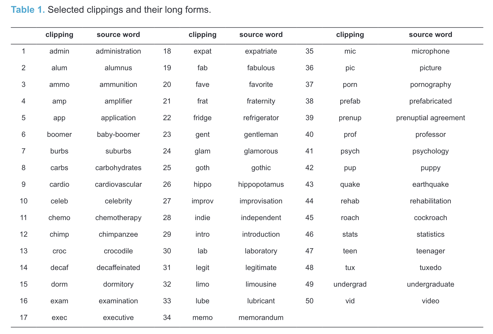

::: {.notes}
- 10:58–11:00
- Show Table 1; students will choose pairs for practice later
:::

## Method

Collocation analysis to investigate semantic profiles across contexts.

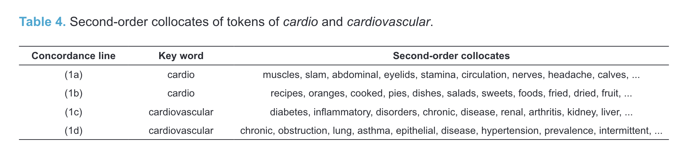

::: {.notes}
- 11:00–11:02
- Already covered in Q2 and Q5
:::

## Results

### Variation across text types

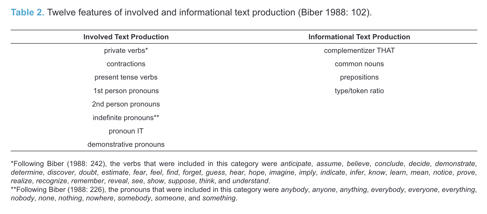

::: {.notes}
- 11:02–11:04
- Already covered in Q3
:::

___

### Semantic differences

Differences in collocations for *cardiovascular* vs *cardio*

::: {.notes}
- 11:04–11:05
- Already covered in Q5
- BREAK — announce 5-minute break at 11:05; resume 11:10
:::

# Practice: studying meanings using Sketch Engine {#practice-studying-meanings-using-sketch-engine}

## Your Task

1. Choose one of the word pairs from [the sample above](#data-sample) [@Hilpert2023Meaning].
2. Use the collocations and word sketches in the [enTenTen21](https://www.sketchengine.eu/ententen-english-corpus/) corpus to analyse their meanings.
3. Use the [Guiding Questions](#guiding-questions) below to structure your analysis.
4. Take notes in [this PowerPoint file](https://1drv.ms/p/c/9a2ec97d593520f9/IQDlqTdaQcKqRYKvlGBjXmTLAdP_wF-qXEH-2Aj8WIGvOqc).
5. Share your findings with the class.

::: {.notes}
- AFTER BREAK — resume at 11:10
- 11:10–11:13
- Explain task, form groups
:::

## Collocation analysis

### 1. Run a query

e.g. `[word="brother" & tag="N.*"]`

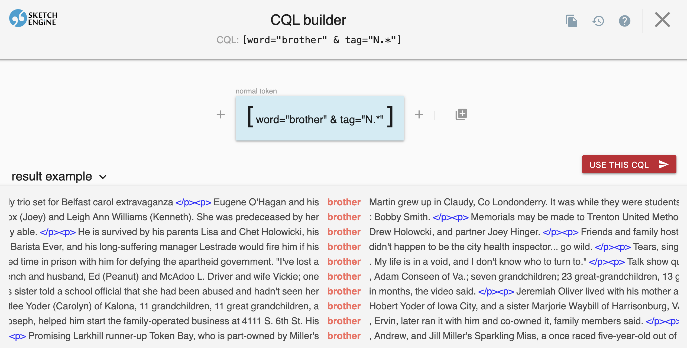

::: {.notes}
- 11:13–11:15
- Quick refresher — students know this from Session 6
:::

---

### 2. Click the collocation analysis icon

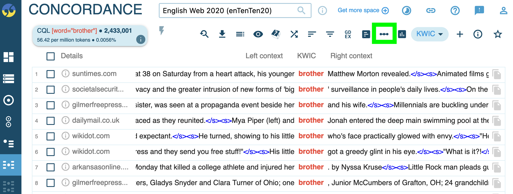

::: {.notes}
- 11:15–11:16
:::

---

### 3. Configure window range and statistics

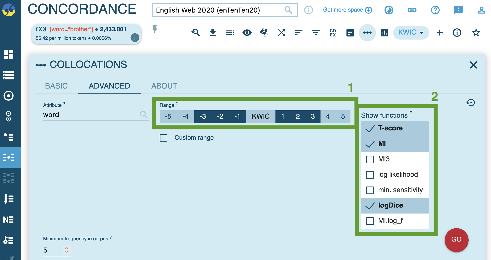

::: {.notes}
- 11:16–11:17
:::

---

### 4. View the results and test collocation measures

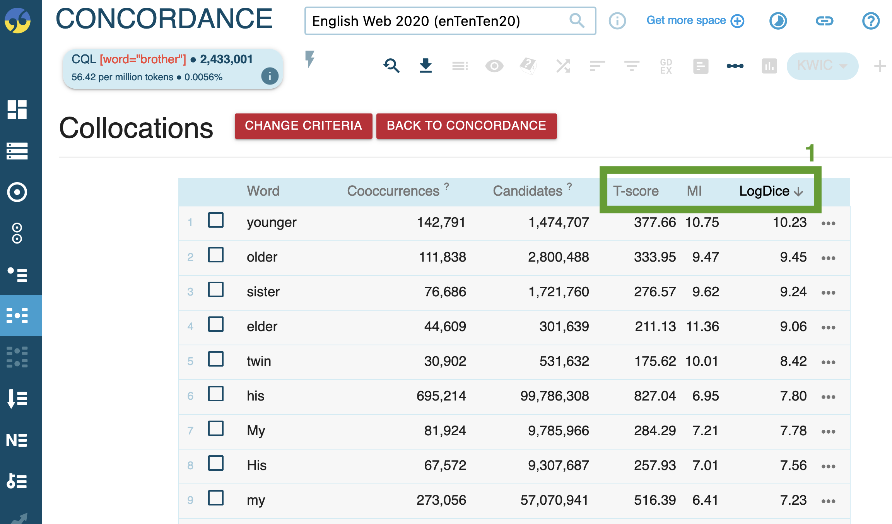

::: {.notes}
- 11:17–11:18
:::

## Word sketches: Single forms

### 1. Generate a word sketch for a clipped form (e.g. *exam*), specifying the word class.

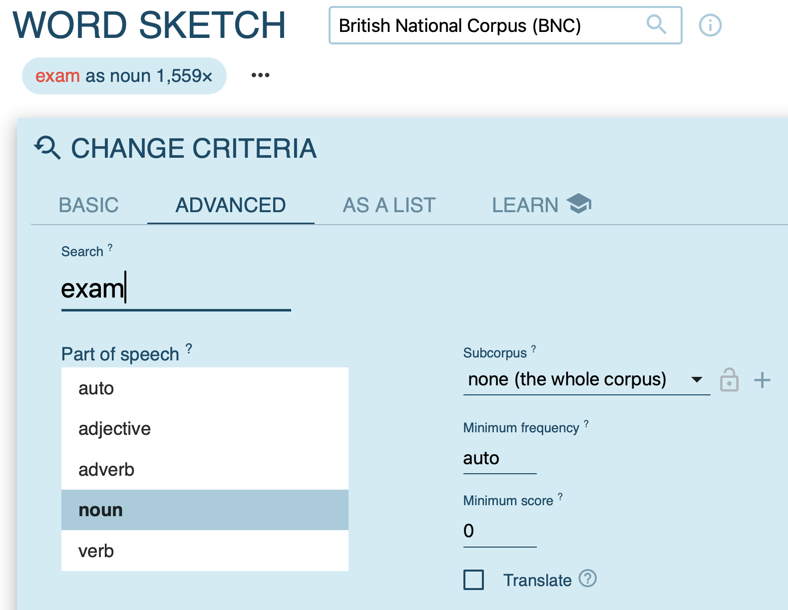

::: {.notes}
- 11:18–11:19
:::

---

### 2. Examine syntactic contexts.

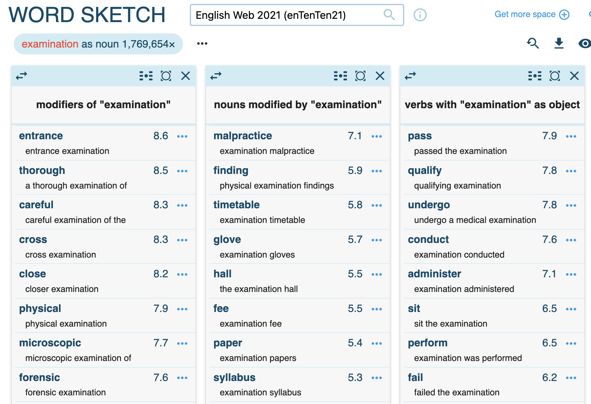

::: {.notes}
- 11:19–11:20
:::

---

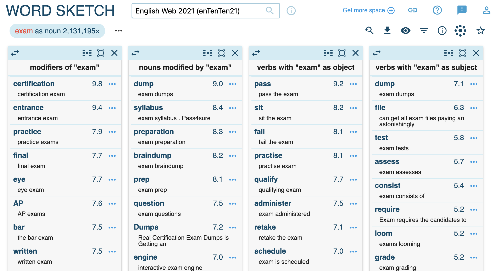

::: {.notes}
- 11:20–11:21
:::

---

### 3. Visualise results.

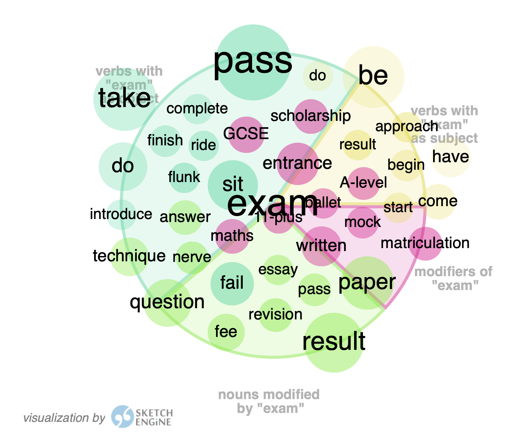

::: {.notes}
- 11:21–11:22
:::

## Word sketches: Comparison

### 1. Compare source words and clipped forms (e.g. *examination* vs *exam*).

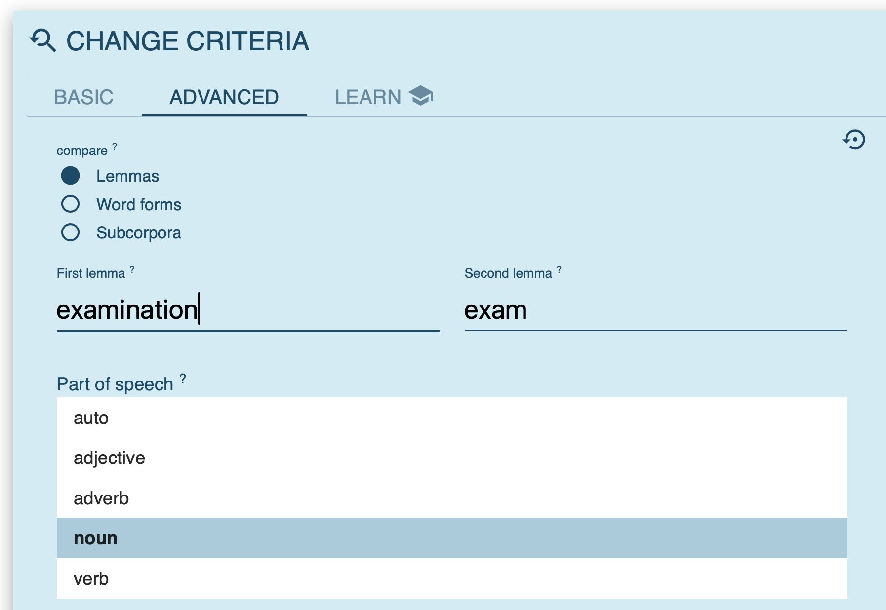

::: {.notes}
- 11:22–11:23
:::

---

### 2. Review shared and unique collocates.

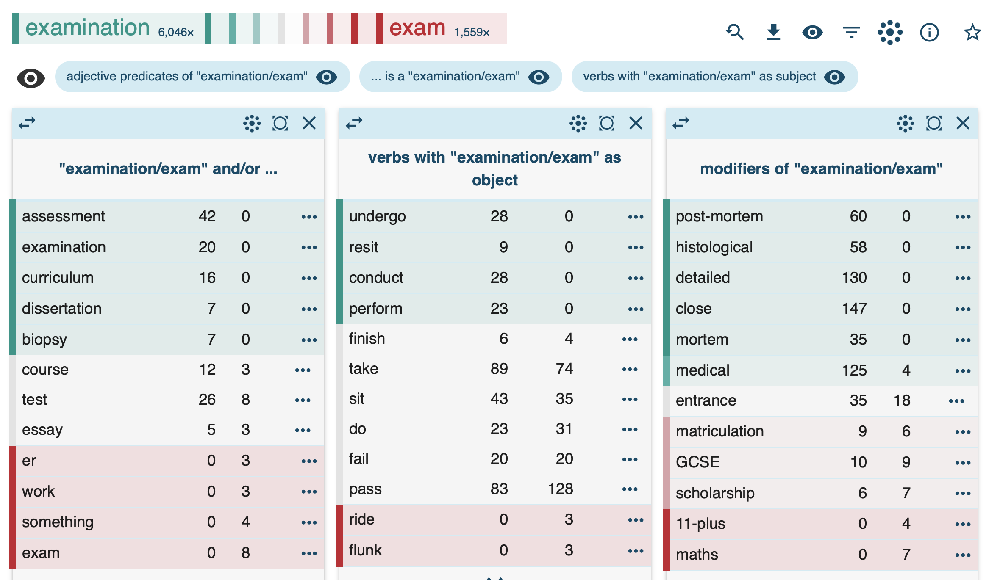

::: {.notes}
- 11:23–11:24
- Students start working after this slide
:::

---

### 3. Inspect collocations in detail.

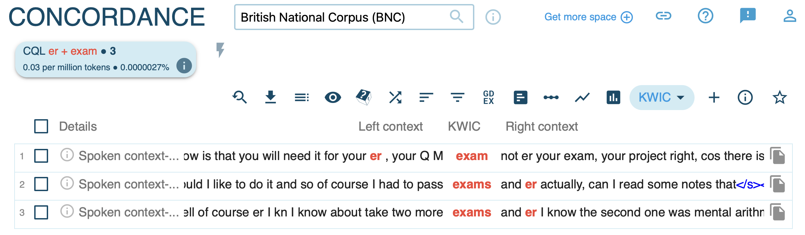

::: {.notes}
- 11:24–11:25
:::

## Guiding questions {#guiding-questions}

1. What is the general semantic signature of the source word?
2. What is the general semantic signature of the clipped form?
3. In what ways do they differ (stylistic, social, formality)?
4. Do they occur in different syntagmatic contexts despite similar denotation?
5. Does the clipped form have a wider or narrower scope of meaning?

::: {.notes}
- 11:25–11:38 — GROUP PRACTICE (13 min)
- Students work in groups; circulate and assist
- 11:38–11:43 — GROUP REPORTS (5 min)
- Each group shares 1–2 key findings
:::

# Summary {#summary}

- **A difference in form (often) implies a difference in meaning.** (Principle of No Synonymy)
- **Meaning is use.** The contexts a word appears in tell us about its function. (Distributional Hypothesis)
- **Clippings are not just lazy shortcuts.** They develop unique semantic, pragmatic, and social functions, often signalling familiarity and appearing in more "involved" contexts.

::: {.notes}
- 11:43–11:45
:::

# References

:::: {#refs}
::::