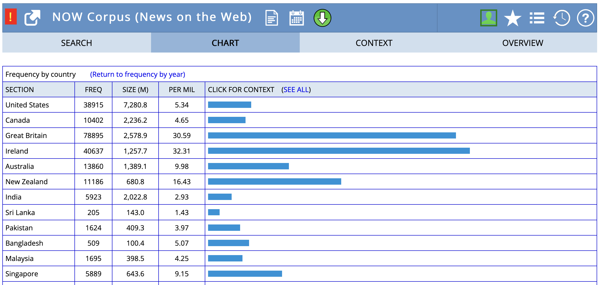
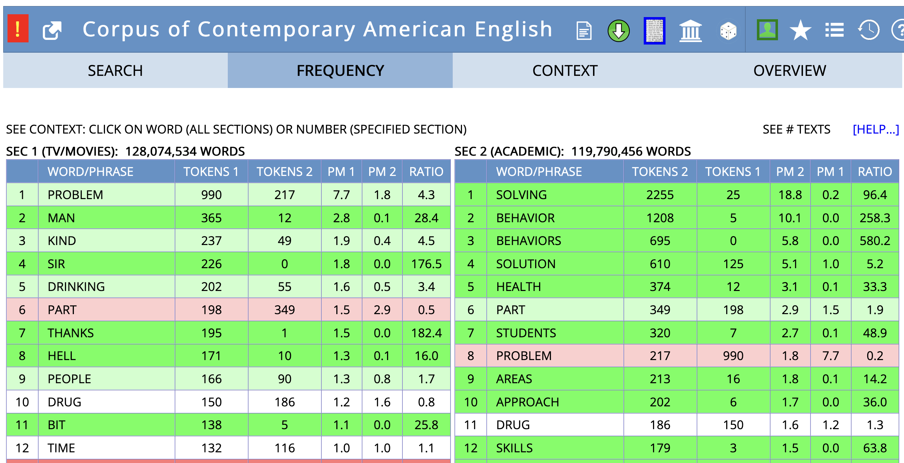
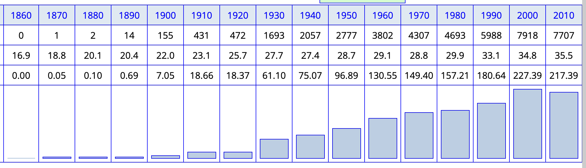
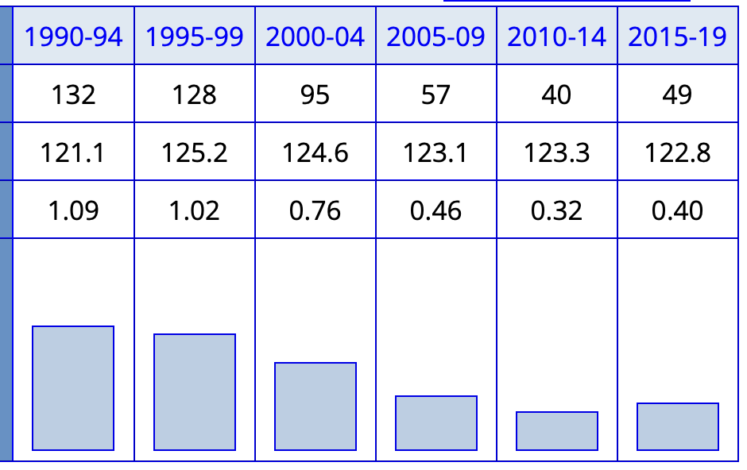
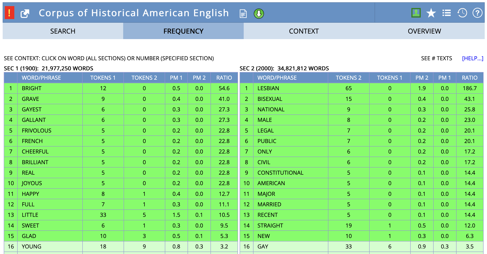
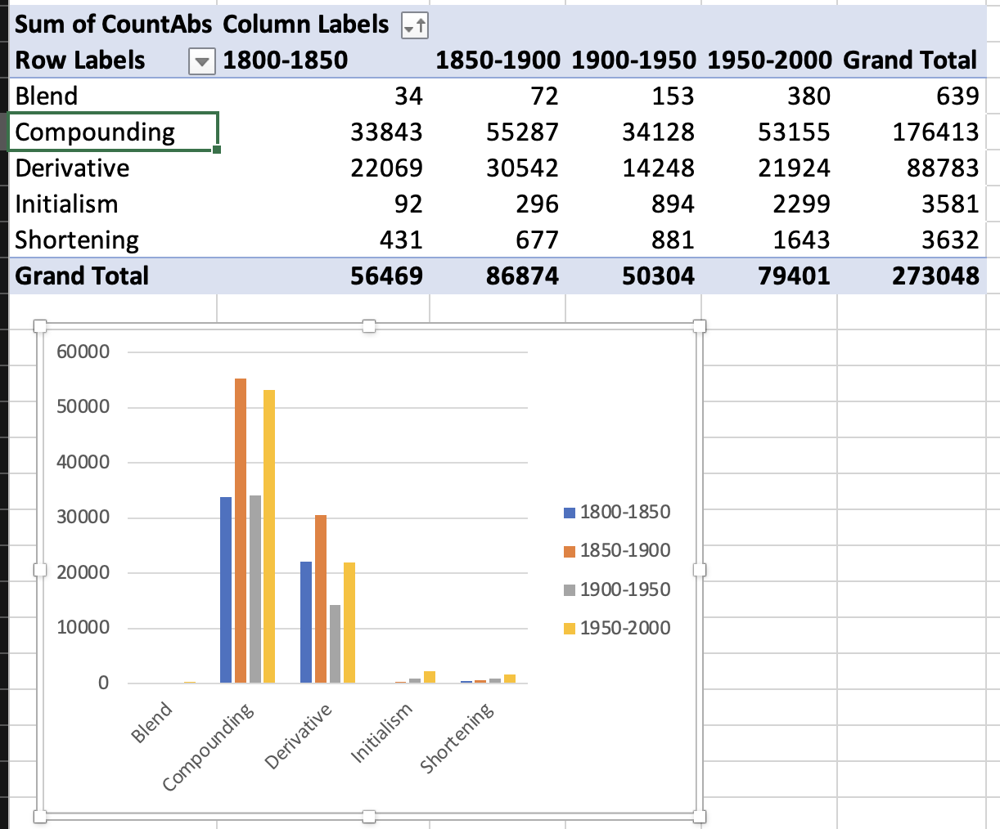
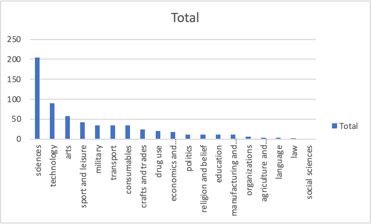
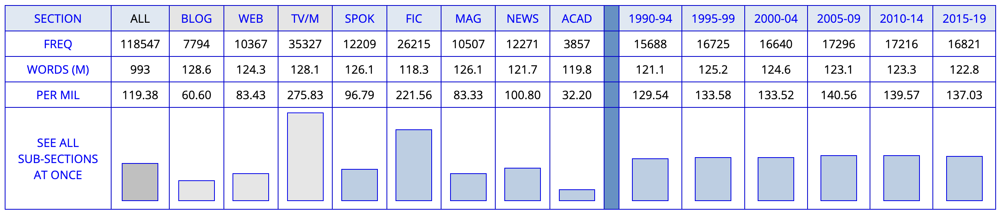
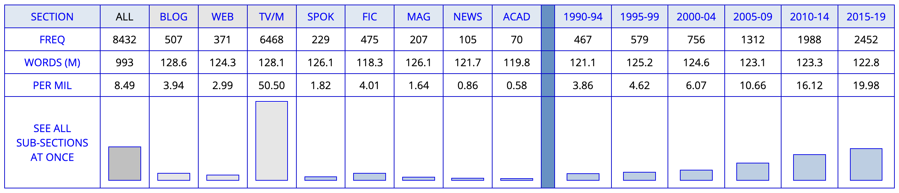

::: {.content-hidden when-format="revealjs"}
[Open slides version](slides.html){.btn .btn-primary}
:::

# Outline

- [Assessment](#assessment) — Term paper consulting, submission requirements, Modulprüfung
- [Developing Research Projects](#developing-research-projects) — Goals, topics, research questions
- [Research Areas and Examples](#research-areas-and-examples) — Lexical variation, change, word-formation
- [Data Sources and Methods](#data-sources-and-methods) — Corpus and dictionary resources
- [Academic Resources and Tools](#academic-resources-and-tools) — Finding references, citation management, writing tools
- [Workshop](#workshop-your-research-project) — Develop your research project

# Assessment

## Term paper consulting

::: {.columns}
:::: {.column width="50%"}
### Procedure

- Register via [email](mailto:q.wuerschinger@lmu.de)
- Send preliminary information at least one day before meeting:
    - research questions and hypotheses
    - theoretical background, data and method
    - table of contents and bibliography
::::
:::: {.column width="50%"}
### Dates and times

- Thu, 12 Feb
    - 10:00
    - 16:00
- Fri, 13 Feb
    - 10:00
    - 16:00
::::
:::

---

### Zoom room

- <https://lmu-munich.zoom.us/j/5385530182?pwd=SE5iZDJGQlZ1V3dpN2Q4NW45WjF5Zz09>
- Meeting ID: 538 553 0182
- Passcode: 531379

## Submission 

::: {.columns}
:::: {.column width="50%"}
### Requirements and format

- **3 ECTS**: short paper (≈ 3–5 pages)
- **6 ECTS**: long paper (≈ 10–12 pages)  
- **9 ECTS**: [Modulprüfung](#modulpruefung)
::::
:::: {.column width="50%"}
### Deadlines

- short papers: **27 Feb**
- long papers: **20 Mar**

::::
:::: {.callout-note}
For exact requirements, please check your Studien-/Prüfungsordnung.
::::
:::

## Modulprüfung {#modulpruefung}

You have to be enrolled in both the Seminar and the Übung class this semester.

All of the assessment for the Modulprüfung takes place in the Seminar.

- presentation: **27 Feb**
- long paper: **20 Mar**

### Presentation

  - **scope**: recorded presentation on your term paper project (RQ and hypotheses, related work, data, method, initial results, discussion, bibliography)
  - **format**: slides + audio (+ video) (e.g. on MS PowerPoint)
  - **length**: 9–11 minutes

# Developing Research Projects

## Goals for term papers

- Research question with a **linguistic focus**
- **Empirical study** using real data
- Use **corpus and/or dictionary data**
- Contribute new insights to lexicology

. . .

### Your term paper should demonstrate

- Understanding of theoretical concepts and related research
- Ability to work with linguistic data
- Critical analysis and interpretation skills

## What makes a good topic?

A good research topic:

- is **not too general** but also **not too specific**
- has further **relevance for linguistics**
- includes **new aspects** based on state of the art
- is **interesting and doable**
- is based on **previous knowledge** and/or observations
- allows for a number of **research questions**

___

## From topic to title

Your title is the business card of your paper:

- Must be **informative and explicit**
- Must have a **reasonable link** to the content
- Must not **raise expectations** that are not met
- Often good to use a **subtitle**

___

## Finding research questions

Research questions can come from:

. . .

1. **Previous literature**
    - suggestions for future research
    - replicating someone else's work
    - identifying gaps in knowledge

. . .

2. **Observation**
    - noticing patterns in language use
    - personal linguistic experiences

. . .

3. **Empirical findings**
    - discoveries within your own data analysis

## Research questions: Key criteria

Ask yourself:

- Is it **broad enough** to be interesting?
- Is it **narrow enough** to be doable?
- Does it have a **strong enough linguistic focus**?

::: {.fragment}
- What do I **expect** the outcome to be? (**hypotheses**)
- Why do I expect these results?
- How does my question relate to **previous work**?
:::

## Practice: Improving research questions

Try to improve these research questions. For each one, identify what's wrong and suggest a better version.

1. "How do people use words differently?"
2. "What is the frequency of the word *Brangelina* in COCA?"
3. "What's the difference between *exam* and *examination*?"
4. "How has the English lexicon changed over the past 500 years?"
5. "Are compounds and blends different?"

### RQ1 "How do people use words differently?" {.excl .slide}

- **Problems**: Too vague and broad; no specific linguistic focus; no indication of what kind of variation (regional, register, text type); not answerable
- **How to improve**: Focus on specific variation type (e.g., regional, text type, register); specify lexical items or word-formation processes; add method indication
- **Improved example**: "How do phrasal verbs (e.g., *look up*, *take off*) differ in frequency and usage patterns across academic vs informal text types in COCA?" or "How does the frequency of intensifiers (*really* vs *very*) vary across spoken vs written registers in the BNC?"
- **Why better**: Specific variation type, clear lexical items, method/data source indicated

### RQ2 "What is the frequency of the word *Brangelina* in COCA?" {.excl .slide}

- **Problems**: Not a research question - it's a descriptive fact-finding task; no theoretical angle; no research purpose; could be answered with a single number
- **How to improve**: Add theoretical framework (productivity, semantic domain, word-formation type); ask about patterns, changes, or comparisons; connect to lexicological concepts
- **Improved example**: "How has the productivity of blending processes changed over time, as evidenced by the rise of words like *Brangelina*, *glitterati*, and other recent blends?" or "What semantic domains do recent blends belong to, and how does this compare to earlier blending patterns?"
- **Why better**: Addresses theoretical question about word-formation; compares patterns; connects to lexicological concepts

### RQ3 "What's the difference between *exam* and *examination*?" {.excl .slide}

::: {.small}
- **Problems**: Too simple; lacks theoretical grounding; no method indicated; could be answered with intuition; doesn't connect to course concepts; focuses on single word pair rather than patterns
- **How to improve**: Connect to Principle of No Synonymy or Distributional Hypothesis; specify method (collocation analysis, word sketches, frequency by text type); frame as theoretical question; expand to lexical field or word-formation process
- **Improved example**: "Do clippings and their source words (e.g., *exam*/*examination*, *lab*/*laboratory*, *ad*/*advertisement*) show distinct distributional patterns that support the Principle of No Synonymy, as revealed through collocation analysis and word sketch comparison in COCA?" or "How do the collocational profiles of clippings vs their source words differ across text types, and what do these differences reveal about register variation and semantic/pragmatic functions?"
- **Why better**: Grounded in theoretical framework (Principle of No Synonymy/Distributional Hypothesis); specifies method; addresses lexicological concepts; studies word-formation process (clipping) rather than single pair; allows for pattern identification
:::

### RQ4 "How has the English lexicon changed over the past 500 years?" {.excl .slide}

- **Problems**: Scope impossibly large; not answerable in a term paper; too ambitious; no specific focus; would require massive dataset
- **How to improve**: Narrow to specific words, word-formation processes, or semantic domains; limit time period; focus on specific register or text type; make it doable
- **Improved example**: "How has the frequency and usage of modal verbs changed in written English from the 19th to 21st century, as evidenced in COHA?" or "What patterns of semantic change can be observed in specific lexical items (e.g., *gay*, *nice*) from 1800 to 2000 in COHA?"
- **Why better**: Focused scope (specific lexical items or processes); manageable time period; answerable with available data; connects to course concepts

### RQ5 "Are compounds and blends different?" {.excl .slide}

- **Problems**: Yes/no question (limits scope); too general; no specific focus on what kind of differences; no method indicated; doesn't leverage course concepts
- **How to improve**: Specify what kind of differences (distributional, semantic, productivity, behavioural profiles); add method; make it comparative and analytical
- **Improved example**: "How do the behavioural profiles of compounds (e.g., *blackbird*, *coffee pot*) and blends (e.g., *Brangelina*, *glitterati*) differ in terms of frequency, text type distribution, and semantic domains in COCA?" or "What differences in productivity and distribution patterns exist between morphemic (compounding) and non-morphemic (blending) word-formation processes over time?"
- **Why better**: Specifies type of differences; includes method; connects to theoretical concepts (morphemic vs non-morphemic, behavioural profiles); analytical rather than yes/no

**General points to emphasize:**
- Good RQs are specific, focused, and answerable with available data and methods
- They connect to theoretical frameworks students have learned
- They indicate both what to study and how to study it
- They are doable within the scope of a term paper
- They contribute to lexicological knowledge, not just describe facts
:::

## Academic paper structure

- **Introduction**: Contextualise and motivate
- **Theoretical Background**: Review relevant literature
- **Data**: Describe your dataset
- **Method**: Explain your approach
- **Results**: Present findings clearly
- **Discussion**: Interpret and discuss
- **Conclusion**: Summarise and reflect

## Theoretical angles for research projects

Empirical research in lexicology connects to theoretical questions. Consider these angles:

**Multi-word expressions** ([Session 02](sessions/02_lexicon/02_lexicon.qmd))

- **Examples**: compounds (*blackbird*, *coffee pot*), phrasal verbs (*look up*), collocations (*strong tea*, *make a decision*), idioms (*kick the bucket*)
- **Research angles**: Compare variation in compound spelling (*honey bee* vs *honeybee*); analyse collocation strength continuum; investigate phrasal verb patterns across text types

---

**Inflection vs derivation** ([Session 02](sessions/02_lexicon/02_lexicon.qmd))

- **Distinction**: Inflection = grammatical word-forms (*walk*, *walks*, *walked*); derivation = new lexemes (*employ* → *employer*, *employable*)
- **Research angles**: Distribution differences across text types; productivity of derivational vs inflectional patterns

**Morphemic vs non-morphemic processes** ([Session 03](sessions/03_morphology/03_morphology.qmd))

- **Examples**: Morphemic (derivation: *friendship*, compounding: *blackbird*) vs non-morphemic (conversion: *cook* V→N, clipping: *fridge*, blending: *Brangelina*)
- **Research angles**: Compare compounding vs blending in usage patterns; analyse productivity differences

---

**Productivity of word-formation processes** ([Session 03](sessions/03_morphology/03_morphology.qmd))

- **Concept**: Some processes create more new words than others
- **Research angles**: Track productivity of specific affixes over time (e.g., *-ness* vs *-th*); compare productivity across different processes

**Behavioural profiles of different processes** ([Session 03](sessions/03_morphology/03_morphology.qmd))

- **Concept**: Different word-formation processes show different usage patterns
- **Research angles**: Compare distribution patterns; analyse semantic constraints; investigate text type preferences

---

**Principle of No Synonymy** ([Session 07](sessions/07_semantics/07_semantics.qmd))

- **Concept**: Form differences indicate meaning differences (semantic, pragmatic, register)
- Examples: *cardio* vs *cardiovascular*, *exam* vs *examination*, *brother* vs *bro*
- **Research angles**: Test with clipping pairs; compare near-synonyms using corpus analysis

**Distributional Hypothesis** ([Session 07](sessions/07_semantics/07_semantics.qmd))

- **Concept**: "You shall know a word by the company it keeps" - meaning is reflected in contextual patterns
- **Examples**: *happy* and *joyful* share collocates; collocation analysis reveals differences between *cardio* and *cardiovascular*
- **Research angles**: Use collocation profiles and word sketches to study meaning; analyse contextual patterns

---

**Involved vs informational contexts** ([Session 07](sessions/07_semantics/07_semantics.qmd))

- **Concept**: Involved (interpersonal, affective) vs informational (detached, high information density) text production
- **Examples**: Clippings appear more in involved contexts; source words in informational contexts (12 markers tested in clippings study)
- **Research angles**: Analyse register variation; test text type distributions; compare involved vs informational markers

# Research Areas and Examples

Now let's explore concrete research areas you might investigate, along with methods and tools we've covered in previous sessions.

## Lexical variation

How do words vary across:

- **Text types**: e.g. academic vs. social media
- **Regional varieties**: e.g. British vs. American English  
- **Word-formation processes**: e.g. blending differences between registers

**Methods from [Session 06](sessions/06_corpora/06_corpora.qmd):** Frequency by text type analysis (e.g., *yeah* vs *yes* in BNC 2014 Spoken), collocation analysis, concordance searches using CQL queries

---

### Regional variation: *autumn* vs *fall* in BrE and AmE

---

### Semantic variation across text types: *problem*

## Lexical change

- **Frequency change**: How word usage changes over time
- **Meaning change**: How word meanings evolve

**Methods:** Diachronic corpora (COHA, COCA), frequency tracking over time, collocation analysis to detect semantic shifts

---

### Frequency increase

**Method:** Track frequency changes over time in diachronic corpora like COHA

---

### Frequency decrease

{height=400}

**Method:** Use corpus frequency analysis to identify declining word usage patterns

---

### Collocates of *gay* in COHA showing semantic shift

{height="450"}

**Method:** Analyse collocation changes over time ([Session 06](sessions/06_corpora/06_corpora.qmd): collocation analysis) to reveal semantic shifts

## Word-formation patterns

::: {.columns}
:::: {.column width="50%"}
### Example analyses

- **Distribution** of word-formation processes across domains
- **Productivity** of morphological processes over time
- **Semantic constraints** on word formation
::::
:::: {.column width="50%"}
### Productivity of word-formation processes over time

::::
:::

---

### Distribution of shortenings across semantic domains

{height="400"}

**Approach:** Use data from the OED (and corpora) to investigate semantic differences.

## Linking research areas to methods and tools

**Lexical variation** → Frequency by text type ([Session 06](sessions/06_corpora/06_corpora.qmd): *yeah*/*yes*, *really*/*very* in BNC 2014 Spoken), collocation analysis, regional corpus comparison

**Lexical change** → Diachronic corpora like COHA (e.g., *phone*, *walkman*), historical dictionaries like OED, frequency tracking over time, collocation analysis for semantic shifts

**Word-formation** → Corpus productivity analysis, distribution across domains (e.g., productivity graphs, semantic domains), dictionary analysis

---

**Semantic analysis** → Collocation profiles and word sketches ([Session 07](sessions/07_semantics/07_semantics.qmd): *cardio*/*cardiovascular*, *exam*/*examination*), distributional hypothesis, involved vs informational contexts ([Session 07](sessions/07_semantics/07_semantics.qmd): clippings study)

**Tools:** Sketch Engine (word sketches, collocations, CQL queries), COCA/COHA, BNC 2014 Spoken, OED

# Data Sources and Methods

## Types of data

### Dictionary data

- Historical dictionaries (OED)
- Contemporary dictionaries
- Learner dictionaries

### Corpus data

- Large collections of authentic language use
- Diachronic corpora (COHA) vs. synchronic (BNC)
- Specialised corpora (academic, social media)

## Key corpus resources {.small}

Selected examples:

### Synchronic corpora

- **BNC 1994**: British National Corpus (100M words)
- **BNC 2014**: British National Corpus (100M words)

### Diachronic corpora

- **EEBO**: Early English Books Online
- **Google Books Ngram**: Historical frequency data
- **COHA**: Corpus of Historical American English (1810s-2000s) [@Davies2010CorpusHistorical]
- **COCA**: Corpus of Contemporary American English [@Davies2008CorpusContemporary]
- **NOW**: News on the Web corpus (real-time) [@Davies2016CorpusNews]
- **[English Trends](https://www.sketchengine.eu/english-trends/)**: huge monitor corpus available on Sketch Engine

## Corpus analysis examples

**Text type variation**: *brother* vs *bro* in COCA

Distribution across genres shows clear patterns:

- *brother*: more formal registers (academic, news)
- *bro*: informal contexts (spoken, fiction)

**Methods from [Session 07](sessions/07_semantics/07_semantics.qmd):** Semantic analysis using collocation profiles and word sketch comparisons (as with *exam*/*examination*, *cardio*/*cardiovascular*); distributional hypothesis to reveal functional differences

---

### **COCA analysis for *brother***:

### **COCA analysis for *bro***:

# Academic Resources and Tools

Once you have your research question and know what data to use, you'll need to find relevant literature and manage your references effectively. The following resources will help you throughout the research process.

## Finding references

::::{.columns}
:::{.column width="50%"}
### Academic databases

- **[LLBA](https://about.proquest.com/en/products-services/llba-set-c/)**: Linguistics and Language Behavior Abstracts
- **[MLA](https://www.mla.org/Publications/MLA-International-Bibliography)**: International Bibliography
- **[JSTOR](https://www.jstor.org/)**: Multidisciplinary digital library
- **[John Benjamins e-Platform](https://benjamins.com/)**: Linguistic publications
- **[ScienceDirect](https://www.sciencedirect.com/)**: Elsevier journals
- **[Cambridge Core](https://www.cambridge.org/core)**: Cambridge University Press
:::

:::{.column width="50%"}
### Web-based tools

- [Google Scholar](https://scholar.google.com/): comprehensive academic search engine
- [Semantic Scholar](https://www.semanticscholar.org/): AI-powered research tool with citation analysis
- [Connected Papers](https://www.connectedpapers.com/): visual maps of research connections
- [OpenAlex](https://openalex.org/): open source academic database
- [Elicit.org](https://elicit.org/): AI research assistant for literature reviews
:::
::::

---

### Strategies

- **Schneeballprinzip**: Find one good reference, follow its citations
- Start with handbooks for quality overviews
- Use research network platforms (ResearchGate, Academia.edu)

---

## Reference management

### Best practices

- Start collecting references early
- Always check for citation accuracy
- Use consistent citation styles
- Maintain one consistent bibliography file as a single source of truth

---

### Tools

**Zotero (recommended):**

- Free, open-source reference manager
- Browser plugin for easy capturing
- Automatic formatting in e.g. MS Word, Google Docs
- Collaborative features for group projects
- Collecting and organising sources
- Integration with word processors

**Alternatives:** Mendeley, EndNote, BibTeX

## Citation styles

For this course, use **author-date format**:

- In-text: "Corpus analysis reveals..." (Hilpert et al. 2023: 25)
- Bibliography: Consistent formatting following one style guide

**Recommended guides:**

- [Anglistik LMU Stilblatt](https://www.anglistik.uni-muenchen.de/service_downloads/allgemeine_handouts/style_sheet_english_version.pdf)
- [Chicago Author-Date Style](https://www.chicagomanualofstyle.org/tools_citationguide/citation-guide-2.html)
- [Unified Style Sheet for Linguistics](https://clas.wayne.edu/linguistics/resources/style)

---

## Writing tools

::: {.columns}
:::: {.column width="50%"}
### Language support

- [dict.cc](https://www.dict.cc/): dictionary search
- [Ozdic.com](https://ozdic.com/): collocations
- [Netspeak](https://netspeak.org/): usage patterns
::::
:::: {.column width="50%"}
### AI-assisted tools

- [DeepL Write](https://www.deepl.com/write)
- [Grammarly](https://www.grammarly.com/)
- [LanguageTool](https://languagetool.org/): free alternative to Grammarly
::::
:::

## Resources

- **Course materials**: Slides and readings on using dictionaries and corpora for studying lexicology.
- **Term paper consulting**: Have a meeting with me to discuss your project.
- [UB courses](https://www.ub.uni-muenchen.de/kurse/schulungstermine/index.html): Research skills and database access
- [Writing centre](https://www.en.schreibzentrum.fak13.uni-muenchen.de/index.html): Academic writing support

::: {.callout-note}
Start early, ask questions, and use the resources available!
:::

# Workshop: Your Research Project

## Individual task

Choose a research area and develop your project. Consider the examples, data sources, and tools we've discussed above.

Use this structure:

- **Topic**: _______
- **Research Question**: _______
- **Hypotheses**: What do you expect to find, and why?
- **Data**: Which corpus/dictionary and why?
- **Method**: How will you analyse the data? (reference specific tools like collocation analysis, word sketches, frequency by text type)
- **Challenges**: What difficulties might you encounter?

## Sharing and feedback

In groups:

1. Present your research question and hypotheses.
2. Get feedback: Is it clear? Interesting? Doable?
3. Discuss data sources and methods.
4. Suggest improvements.

# Summary and outlook

## Summary

- **Good research projects** combine theoretical insight with empirical analysis.
- **Research questions** should be focused, linguistically relevant, and answerable with available data.
- **Corpus and dictionary data** offer rich opportunities for lexicological research.
- **Academic writing** follows established conventions - learn and apply them consistently.
- **Planning and preparation** are key to successful research projects.

## Next week

**Asynchronous task: Work towards your research project.**

- work on your research question and hypotheses
- identify suitable data sources and methods
- check related literature
- try a pilot analysis

**Recommended readings:**

- @Stefanowitsch2020CorpusLinguistics: designing and operationalising linguistic research projects based on corpus data (esp. Ch. 3)

- @Wray2012ProjectsLinguistics: general guidance on planning and conducting research projects in linguistics

# References

:::: {#refs}
::::