::: {.content-hidden when-format="revealjs"}
[open slides](slides.html){.btn .btn-primary} [download slides (pdf)](slides.pdf){.btn .btn-secondary}
:::

# Outline {.slide}

- [Cultural-linguistic innovation](#cultural-linguistic): The interplay of society and language
- [S-curve model](#s-curve-model): Diffusion and change patterns
- [EC-Model](#ec-model): Entrenchment and conventionalisation
- [Diffusion pathways](#diffusion): Variation and spread
- [Operationalisation](#operationalisation): Frequency measures and corpus methods
- [Practice](#practice): Studying lexical innovations in corpora
- [Summary](#summary): Key takeaways


# From words to innovation {.slide #warm-up}

1. **Word formation processes**: Which processes create completely new word forms?
2. **Semantic change**: How can existing words develop new meanings?
3. **Dictionary evidence**: How do dictionaries track and document new words?

. . . 

**Today's focus**: How do these processes work in real time? What drives innovation and how does it spread?


# Research foundation {#research-foundation}

## Social networks of lexical innovation {.small}

[@Wurschinger2021Social]{.fullcite}

### Research approach

- **Longitudinal study**: 99 English neologisms tracked on Twitter
- **Multi-method analysis**: Frequency measures + social network analysis  
- **Temporal dynamics**: Usage patterns, volatility, and diffusion over time
- **Social pathways**: How innovations spread through communities

### Key insights

- **Frequency alone is insufficient** - need temporal and social information
- **Social diffusion varies significantly** - even words with similar frequency show different patterns


## Today's session structure {.slide}

We'll explore the theoretical framework and empirical findings:

1. **Theoretical models**: S-curve and EC-Model for understanding innovation
2. **Operationalisation**: How to measure diffusion using corpus methods
3. **Practical application**: Hands-on analysis with case study words
4. **Comparative analysis**: Your findings vs. published research

. . .

**Goal**: Understand both the theory and practice of studying lexical innovation


# The interplay of cultural and linguistic innovation {.slide #cultural-linguistic}

## Society and language change {.slide #society-and-language-change}

**Key principle**: Society continually changes as new practices and products emerge.

- These changes typically **first manifest themselves in language** on the level of lexis.
- Language change occurs through **neologisms** (new words or new meanings).
- **Knowledge of words is conventional**: speakers learn form-meaning pairings.


## Types of neologisms {.slide #types-of-neologisms}

### Formal neologisms

::: {.fragment}
- *smartphone*
- *iPhone* 
- *Covid*
:::

### Semantic neologisms

::: {.fragment}
- *hotspot* (from physical location → infection cluster)
- *social distancing*
- *spreader* (person → virus transmitter)
- *Querdenker* (lateral thinker → conspiracy theorist)
:::


## Lexical renaissance {.slide #lexical-renaissance}

**Innovation after lexical attrition**: old words returning to use.

**Examples**:

- *dotard* (revived during political discourse)
- *to furlough* (returned during economic crises)

Pattern: Social changes can revive forgotten vocabulary when circumstances make old words newly relevant.


# The S-curve model of lexical innovation {.slide #s-curve-model}

## Integration of diffusion stages

::: {.columns}
::: {.column width="50%"}
![**S-curve model**: Integration of Milroy's and Rogers' model of diffusion stages [@Kerremans2015Web, p. 65]](att/s_curve_model.png){width="600"}
:::

::: {.column width="50%"}
**Early adoption**: Innovative users introduce new words.

**Acceleration**: Rapid spread through social networks.

**Deceleration**: Slower growth as market saturates.

**Stabilisation**: Word becomes established in conventional usage.
:::
:::


# EC-Model: Entrenchment and conventionalisation {.slide #ec-model}

## The dynamics of the linguistic system [@Schmid2020ECModel]

::: {.columns}
::: {.column width="50%"}
**Conventionalisation**: part of the conventional language system.
:::
::: {.column width="50%"}
**Entrenchment**: storage in speakers' mental lexicon.
:::
:::

![The interplay between usage, entrenchment, and conventionalisation [@Schmid2020ECModel, p. 4].](att/ec_model.png){width="700"}


# Pathways of diffusion {.slide #diffusion}

## Types of linguistic variation and diffusion {.slide}

![Types of linguistic variation: diatopic, diastratic, and diaphasic [@Kortmann2020Essentials, p. 204]](att/variation_types.png){width="600"}


## Dimensions of diffusion 

::: {.columns}
::: {.column width="50%"}
### Across speakers and communities

- Regional spread
- Social group adoption
- Age group patterns

### Across text types

- Formal vs informal contexts
- Academic vs popular writing
- Spoken vs written language
:::
::: {.column width="50%"}
### Examples

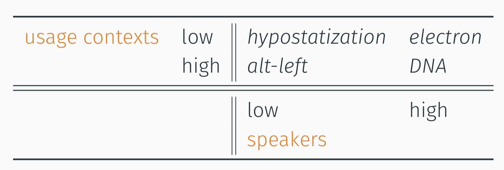{width="700"}
:::
:::


# Operationalisation: frequency as indicator {.slide #operationalisation}

## Theoretical foundation

**Frequency** as indicator for entrenchment and conventionality [@Stefanowitsch2017Corpusbased]:

- **Corpus-as-input**: language in corpora represents potential exposure to speakers.
- **Corpus-as-output**: language used by speakers represents degrees of entrenchment.


## Frequency measures

**Examples from @Wurschinger2021Social**:

### Total frequency patterns

#### Most frequent:

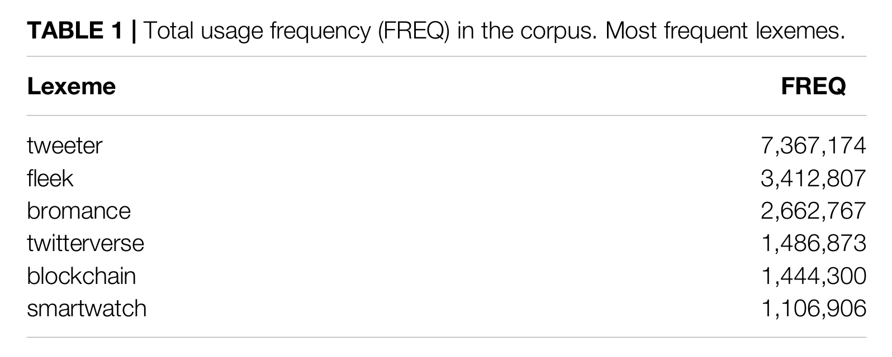

___

#### Around the median

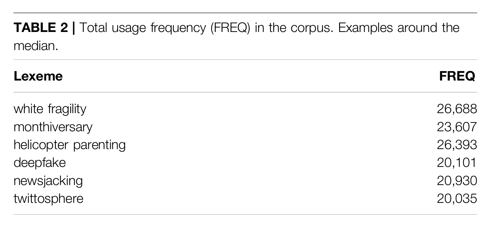{width="500"}

___

#### Least frequent

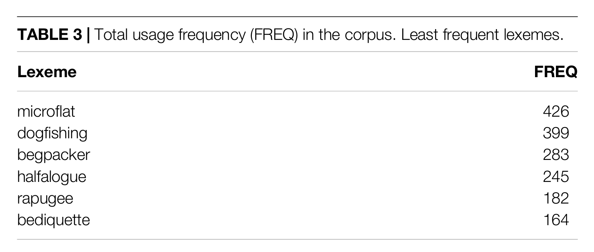{width="500"}

___

#### Case study selection

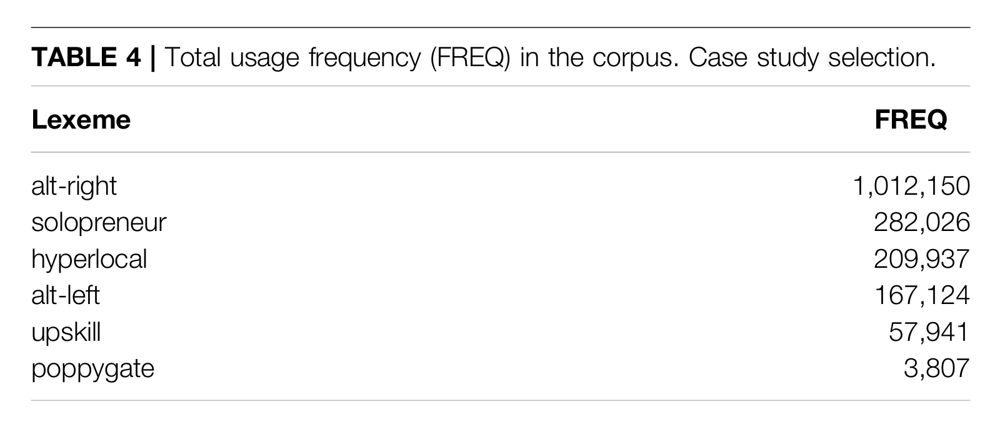{width="600"}


## Frequency over time (diachronic analysis) {.slide}

### Cumulative frequency

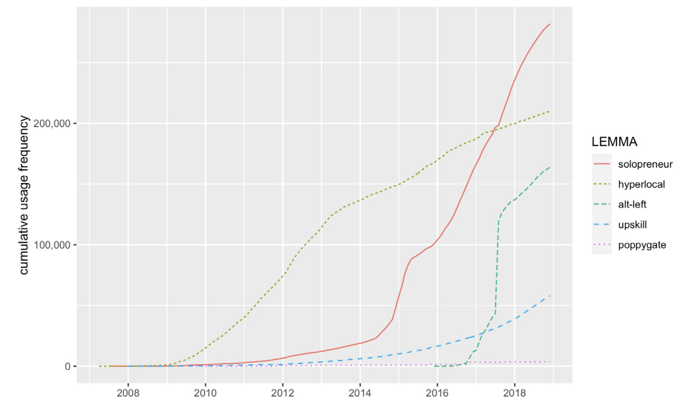

___

### Raw frequency

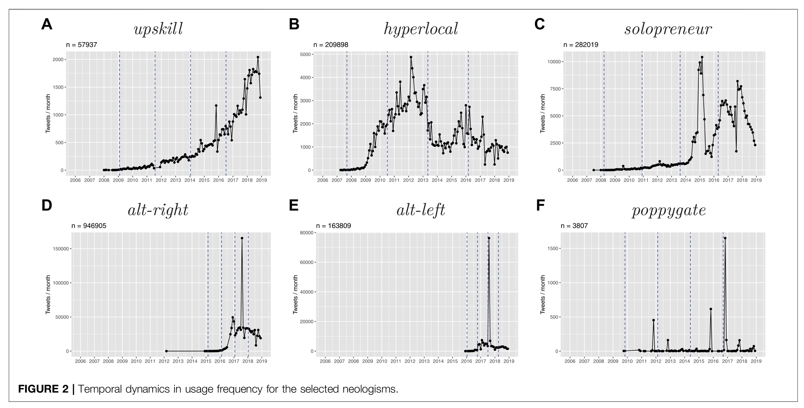

___

## Diffusion over time

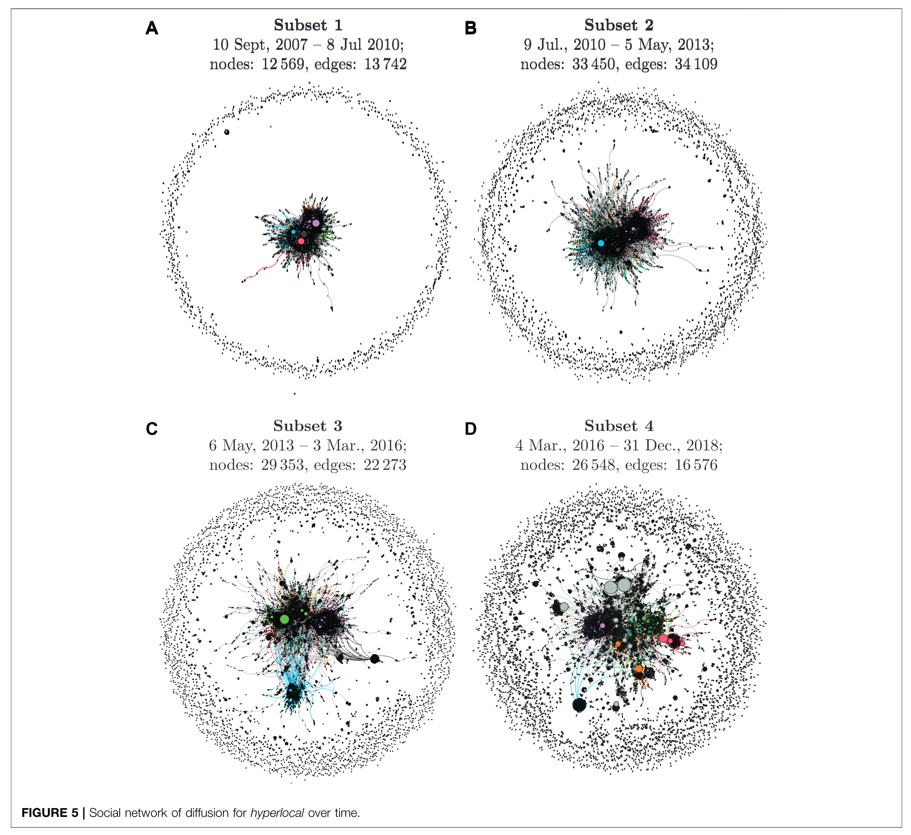

___

## Diffusion across communities

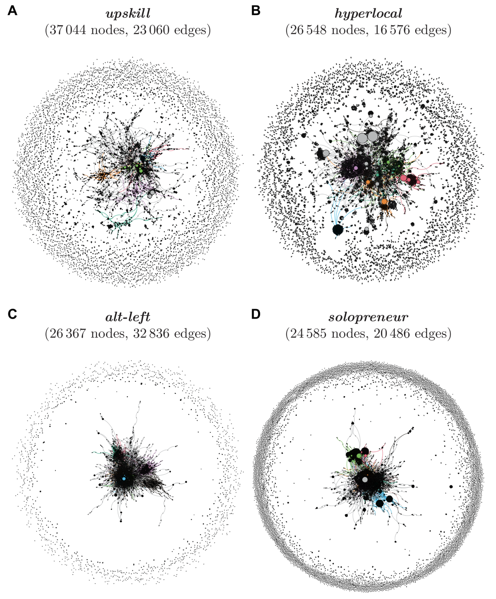


## Diffusion across text types {.small}

### *bro* in COCA

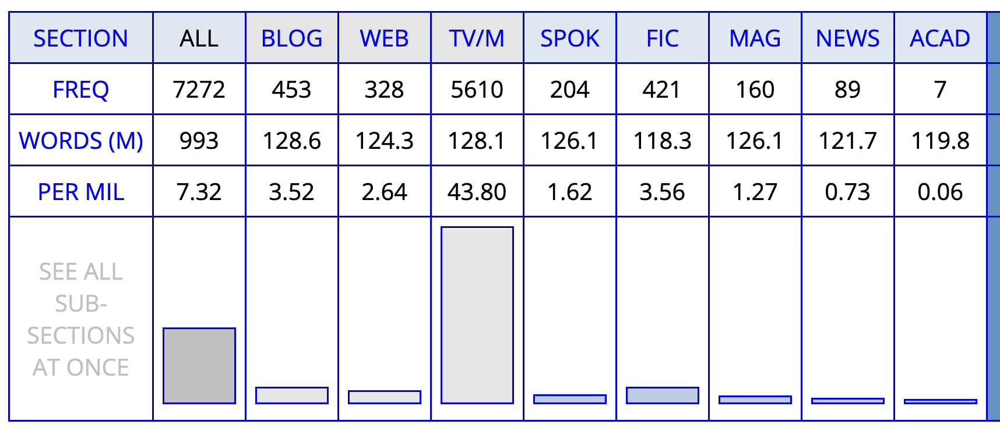{height="250"}

### *brother* in COCA

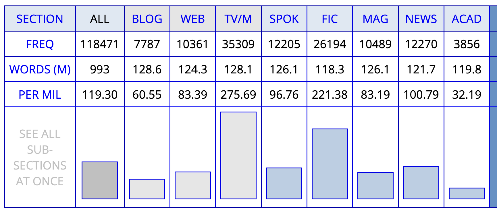{height="250"}


# Practice: identifying pattern of lexical innovation

## OED’s Advanced Search

Use the OED’s Advanced Search to retrieve all words that have first been used since 2000.

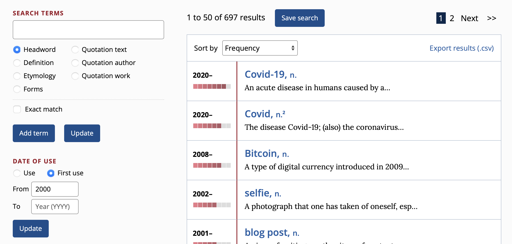

Export the results as a `csv` file.

## Excel analysis

Model sheet: <https://1drv.ms/x/c/9a2ec97d593520f9/EbTMdPaevpFJqGqbQT43l3YBf2Pg02PJ8On1XOLh1JiBcA>

1. import the `csv` file into Excel
2. create a `Table` that spans the imported data (without metadata)
3. created `Pivot Table`s to analyse the data

Analysis:

1. What are the most frequent word classes among the target neologisms?
2. What is their distribution across dates of first use?
3. Which word-formation processes are most common?
4. Which subject areas are most prevalent?


## Sketch Engine analysis

Use Sketch Engine and the BNC 2014 Spoken to analyse the frequency and distribution of the target neologisms.

1. In Excel, selected a sample (e.g. `n=20`) of the target neologisms based on frequency (column `Frequency Band Number`).

2. In Sketch Engine, search for all of these neologisms in one go by concatenating them in a single CQL query. For example:

```
[word="retweet|hashtag|podcast|stan|Covid-19|photobomb|upvote|Covid|deadname|Bitcoin|stablecoin|selfie|SARS|open-world|vlog|vape"]
```

___

Analyse the results by using the `Frequency` tool.

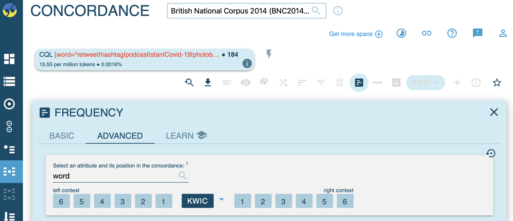

___

1. Frequency by `word`:

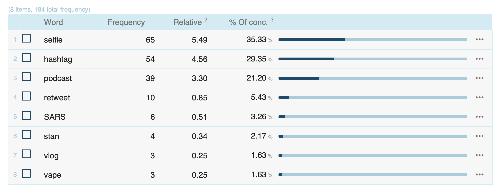

___

2. Frequency by `Age range`:

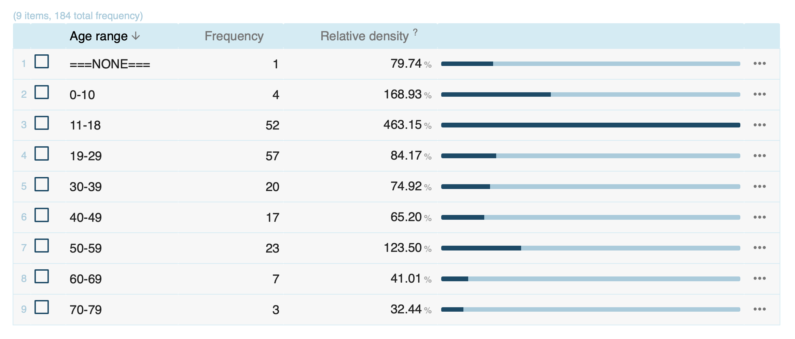


# Summary {#summary}

::: {.incremental}
1. **Cultural and linguistic innovation are intertwined**: societal changes drive lexical innovation.
2. **S-curve model** describes diffusion patterns from innovation to stabilisation.
3. **EC-Model** explains entrenchment and conventionalisation through frequency.
4. **Diffusion occurs across multiple dimensions**: speakers, communities, and text types.
5. **Corpus methods enable empirical study** of innovation and diffusion patterns.
:::


# References

:::: {#refs}
::::