::: {.content-hidden when-format="revealjs"}
[Open slides version](slides.html){.btn .btn-primary}
:::

# The history of the English vocabulary

## The Indo-European language family

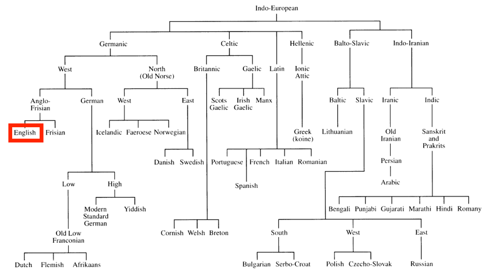{width="700"}

## Old English (ca. 450–1100)

### External history

- **410** (traditional date according to Bede's *Historia Ecclesiastica Gentis Anglorum*: 449): Angles, Saxons and Jutes (and some Frisians), speaking varieties of West Germanic languages, conquer the main British Isle → **Germanic Conquest**
- **c. 700**: earliest written documents in Old English
- **from 6th century**: Christianization
  - Irish missionaries (c. 563 St. Columba to Iona)
  - missionaries from Rome (c. 597; St. Augustine to Canterbury)
- **from 8th century onwards**: Viking raids and Danish settlement
  - 793: sacking of Monastery of Lindisfarne
- **878**: establishment of the 'Danelaw'

---

### Germanic conquest

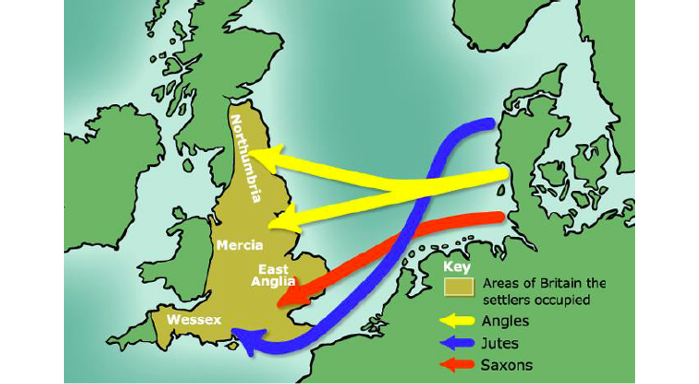{width="500"}

---

### Viking raids and the Danelaw

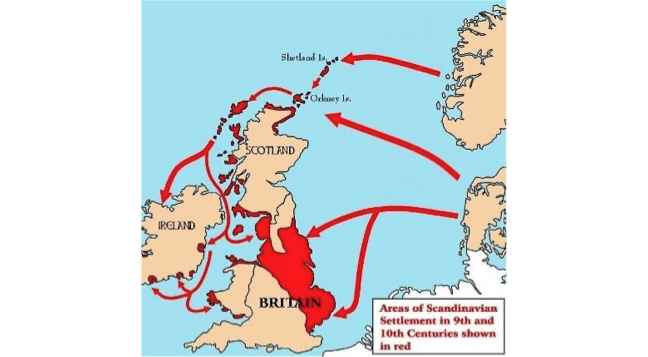{width="500"}

---

#### Linguistic characteristics

- **Word order**: Relatively free.
- **Vocabulary**: Germanic with some Latin (e.g., *wine*, *cheese*, *street*) and Scandinavian (e.g. *take*, *die*, *sky*) loanwords.
- **Morphology**: An inflecting/synthetic language; nouns and adjectives inflect for 4 cases, 2 numbers, and 3 grammatical genders.

___

## Middle English (ca. 1100–1500)

#### External history

- **1066**: Norman Conquest (William the Conqueror; Battle of Hastings)
- for more than three centuries, England was trilingual ('Triglossia'): (Anglo-)French and Latin as 'high variety' and English as 'low variety'
- **from mid-14th century**: English slowly reestablished in various domains (1349 English as language of education, 1362 opening of Parliament, literary language) → English re-introduced as high variety

___

#### High varieties

1. **Latin**: church, learning, documents
2. **French**: upper classes, feudal aristocracy

#### Low variety

3. **English**: peasants, lower clergy, most people in cities

___

### Middle English linguistic characteristics

- **synthetic → analytic shift**: breakdown of inflection due to weakening of final syllables ('Entsilbenabschwächung': /a/, /u/, /o/ > /ə/ > ∅)
- **loss of grammatical gender** (c. 1200): article *the* adopts natural gender
- **increasingly fixed word order** (less flexibility)
- **dialect age**: no generally accepted standard
- **mass borrowing**: war/military, administration/law, religion/church, fashion, social life → mixed Germanic/Romance vocabulary
- huge number of **borrowings** in the field of war/military, administration/law, religion/church, fashion, social life etc. (+ influence on word formation and stress patterns) → end of Middle English: mixed Germanic/Romance vocabulary

___

## Early Modern English (ca. 1500–1800)

#### External history

- **1476**: William Caxton introduces printing press to England
- **1492**: discovery of America
- **Renaissance and Humanism**: rediscovery of classical authors and literature (e.g. translations of classical literature)
- **1534**: Reformation
- **1611**: King James Bible (first official English translation of the Bible for the English church)
- growing literacy → literacy spread down the social ranks, and from the male to the female sex (→ new reading public → translations needed)

___

### Key linguistic developments

- **Great Vowel Shift** (c. 1400/1500): Raising and diphthongisation of long vowels, increasing the discrepancy between spelling and pronunciation.
- **Inflectional system**: The weakening and loss of inflections continues.
- **Word order**: Becomes more fixed (SVO).
- **Standardisation**: Development of the London dialect into a new standard.
- **Orthography**: Emergence of a standardised spelling system.
- **Learned vocabulary**: Influx of loanwords from Latin and Greek ('hard words').

___

## Late Modern English (ca. 1800–1945)

#### External history

- **from 1700s**: British Imperialism → expansion of English all over the world (Australia, India etc.)
- **1700s/1800s**: normativism and prescriptivism (1755: Samuel Johnson *A Dictionary of the English Language* → first comprehensive dictionary of the English language)
- **1900s**: scientific and industrial revolutions → development of technical registers

___

#### Linguistic characteristics

- ***do*-periphrasis**: Becomes obligatory in interrogatives and sentential negation (from 1700).
- **Grammaticalisation**: Beginning of the progressive aspect and present perfect (from 1800).
- **Pronunciation**: Standard British English (RP) becomes non-rhotic.
- **American English**: An emergent standard develops.
- **Global borrowing**: Vocabulary expands with words from languages around the world, leading to **vocabulary expansion and global influence**.

___

## Present-Day English (since ca. 1945)

#### External history

- **New media**: The rise of telephone, TV, internet etc. accelerates change.
- **American English**: Increasing importance and influence after WWI and WWII.
- **Global English**: Established as a world language and a lingua franca.
- **Postcolonial Englishes**: Increasing importance (e.g., Indian English), contributing to a truly **global English** shaped by **technological change**.

# Present-Day English lexicon

## A unique mixture

"Der heutige englische Wortschatz ist eine einzigartige Mischung von germanischen und romanischen Elementen; in Bezug auf das Vokabular stellt also das Englische einen Sonderfall unter den europäischen Sprachen dar." (Leisi 2008: 41)

## Most frequent words in English

**Analysis based on COCA:**

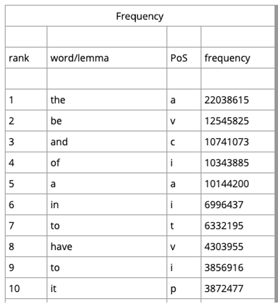{width="400"}

---

### Languages of origin in high-frequency words

**Scandinavian (Old Norse):**

- *they*, *them*, *their*, *both*, *same*, *though*
- *to get*, *to take*, *to give*, *to call*, *to die*, *to seem*, *to want*

**French:**

- *people*, *very*, *country*, *part*, *place*, *point*, *change*, *large*, *sure*, *different*

**French/Latin:**

- *just*, *to use*, *number*, *state*, *question*, *form*

___

## Germanic core vocabulary

Elements surviving from Old English form the basic vocabulary:

- **Pronouns, conjunctions, auxiliary verbs**
- **Fundamental concepts:**
    - OE *mann* → *man*
    - OE *wīf* → *wife*
    - OE *cīld* → *child*
    - OE *hūs* → *house*
    - OE *drincan* → *drink*
    - OE *libban* → *live*

___

## Latin influence

#### Continental borrowings

- *street*, *wine*, *kitchen*, *mile*, *butter*, *cheese*

#### After settlement (post-450)

- *port*, *mount*, *-chester*

#### Christianisation

- *martyr*, *clerk*, *creed*, *nun*, *verse*

#### Renaissance and later

- *humanist*, *abdomen*, *skeleton*

___

## Old Norse influence

#### Viking raids and the Danelaw

- Genetic resemblance between Old Norse and Old English
- Strong influence on **basic vocabulary**

#### Examples

- **Function words**: *they*, *them*, *their*, *though*
- **Verbs**: *to call*, *to die*, *to take*, *to raise*
- **Nouns**: *law*, *husband*, *egg*, *birth*
- **Adjectives**: *awkward*, *ill*, *weak*

**Consequence**: English drifts apart from West Germanic languages

___

## French superstrate influence {.small}

**Superstrate**: socially/politically superior language influences inferior position

- **Government/Administration**: *authority*, *chancellor*, *council*, *court*, *crown*, *duke*, *empire*, *government*, *liberty*, *minister*, *noble*, *palace*, *parliament*, *prince*, *reign*, *royal*, *sovereign*, *treaty*

- **Law**: *accuse*, *advocate*, *assault*, *attorney*, *blame*, *crime*, *evidence*, *fraud*, *jail*, *judge*, *justice*, *pardon*, *plaintiff*, *prison*, *punishment*, *verdict*

- **Religion/Church**: *abbey*, *baptism*, *cathedral*, *charity*, *clergy*, *confess*, *divine*, *faith*, *immortality*, *mercy*, *religion*, *saint*, *sermon*, *temptation*, *virgin*, *virtue*

- **Military/Warfare**: *ambush*, *army*, *battle*, *captain*, *combat*, *defend*, *enemy*, *guard*, *navy*, *peace*, *soldier*, *spy*

- **Food**: *appetite*, *bacon*, *beef*, *cream*, *dinner*, *feast*, *fruit*, *herb*, *lemon*, *lettuce*, *mustard*, *mutton*, *olive*, *pork*, *salad*, *salmon*, *spice*, *veal*

- **Fashion**: *diamond*, *dress*, *fashion*, *fur*, *garment*, *gown*, *jewel*, *lace*, *robe*, *satin*, *wardrobe*

___

## Loans from other languages

- **Portuguese/Spanish**: *marmalade*, *banana*, *cannibal*, *creole*, *mosquito*, *mulatto*, *tobacco*

- **Italian**: *alarm*, *million*, *balcony*, *opera*, *piazza*, *sonnet*, *stanza*

- **Greek**: *bible*, *character*, *climate*, *fantasy*, *horizon*, *tragedy*

- **Arabian**: *admiral*, *elixir*, *hazard*, *mosque*, *alcohol*, *alchemy*

- **Persian**: *azure*, *chess*

___

### Global loan words

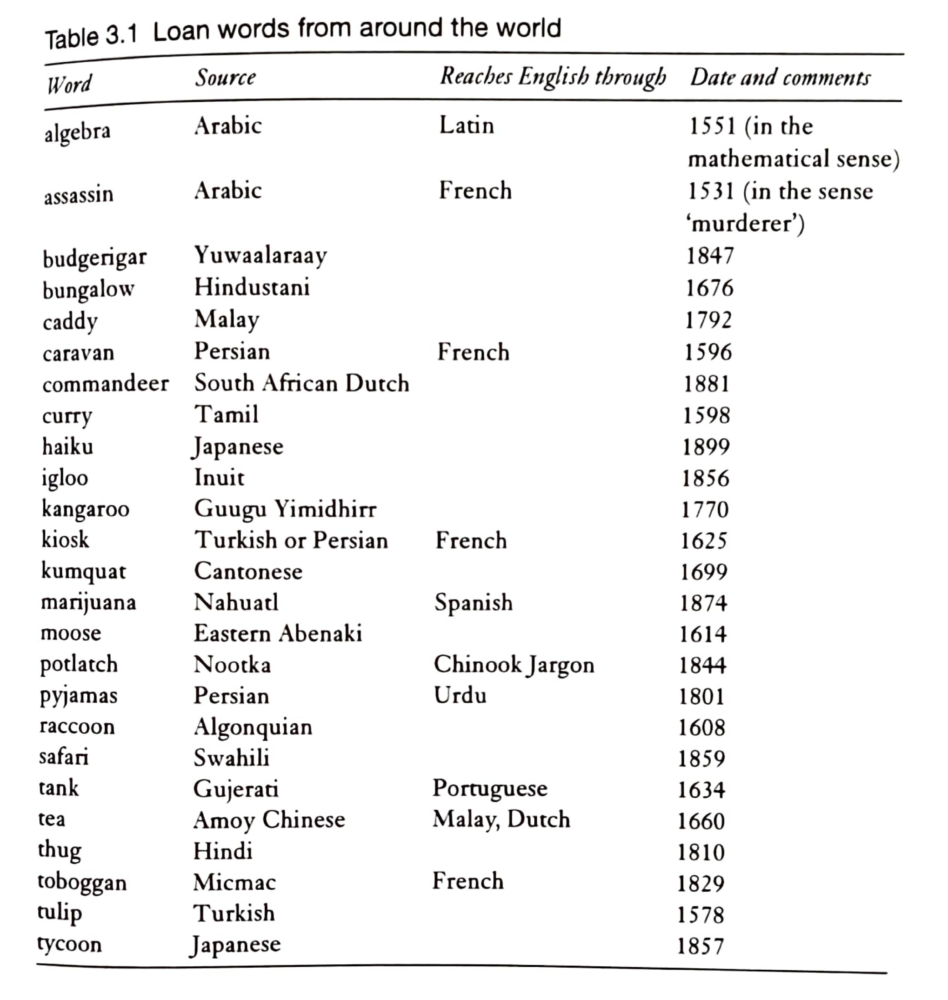{width="700"}

___

## Recent European loans and dialectal terms

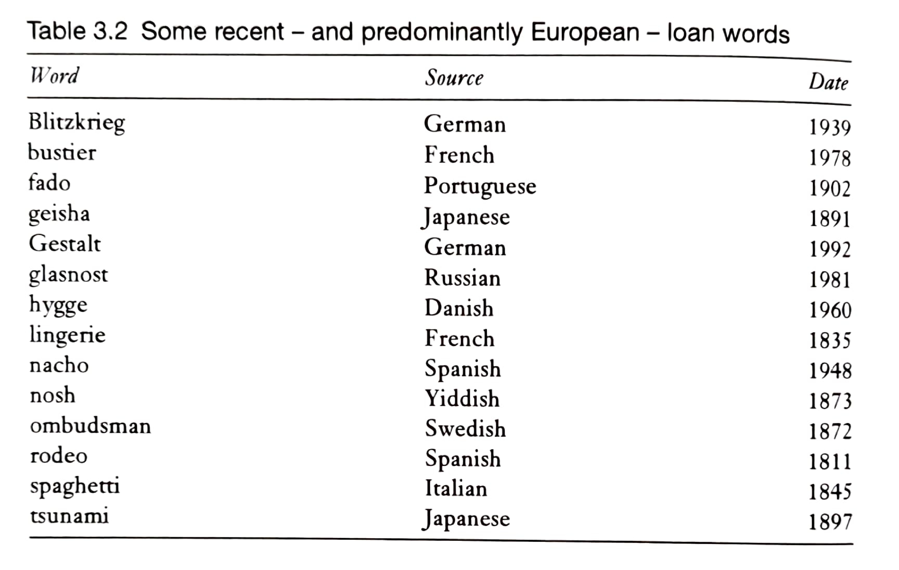{width="450"}

___

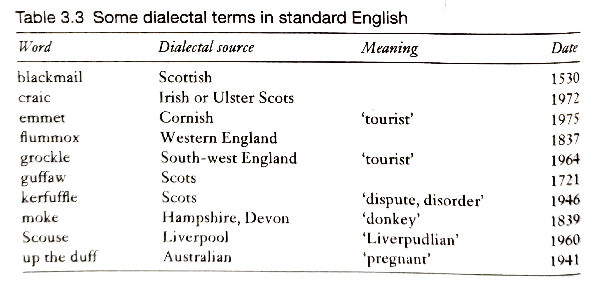{width="450"}

# Types of lexical change

## Consequences of borrowing

### Consociation vs Dissociation

:::: {.columns}
:::: {.column}
#### Consociation: German

- *Mund* – *mündlich*
- *Heiliger* – *heilig*
- *Fuß* – *Fußgänger*
- *Wort* – *wörtlich*
- *Buch* – *Buchstabe* – *Bücherei*
::::
:::: {.column}
#### Dissociation: English

- *mouth* – *oral*
- *saint* – *holy*
- *foot* – *pedestrian*
- *word* – *verbal*
- *book* – *letter* – *library*
::::
::::

___

### Partial synonymy

#### Register differences

- *to ask* (c. 885) — neutral
- *to question* (c. 1470) — formal
- *to interrogate* (c. 1483) — official/legal

#### Connotational differences

- **solitude** vs *loneliness*
- **freedom** vs *liberty*

**Result**: Greater linguistic choice through partial synonyms

___

### "Hard words"

Often etymologically unrelated → difficult to learn:

#### Examples of confusion (malapropisms)

- *illiterate* vs *illegitimate*
- *missile* vs *missive*  
- *epitaph* vs *epithet*

___

## Change in usage frequency

### Lexical innovation

#### The interplay of cultural and linguistic innovation

- Society changes → new practices and products emerge
- Language changes first on the **lexical level** through **neologisms**

::: {.fragment}
**Examples:**

- **Formal neologisms**: *smartphone*, *iPhone*, *Covid*
- **Semantic neologisms**: *hotspot*, *Querdenker*, *social distancing*, *spreader*
:::

___

### Lexical attrition

**Word loss through decreased frequency:**

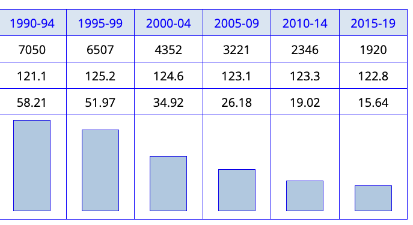{width="400"}

___

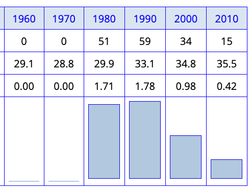{width="300"}

## Meaning change

**Semantic change over time:**

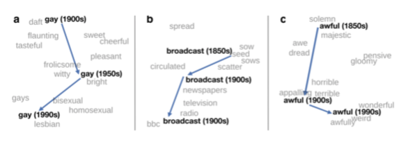{width="700"}

Common patterns: narrowing, broadening, amelioration, pejoration

## Examples of lexical changes

### *whilst*

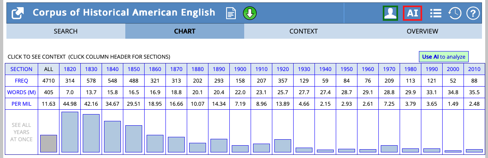

---

### *awfully*

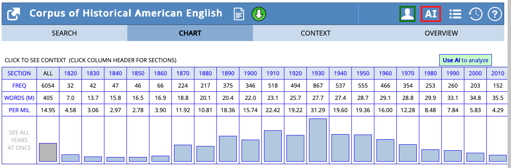

---

### *chairperson*

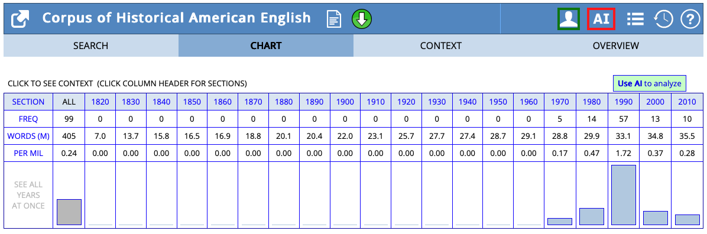

# How to use [english-corpora.org](https://english-corpora.org)

## Overview of corpora {.small}

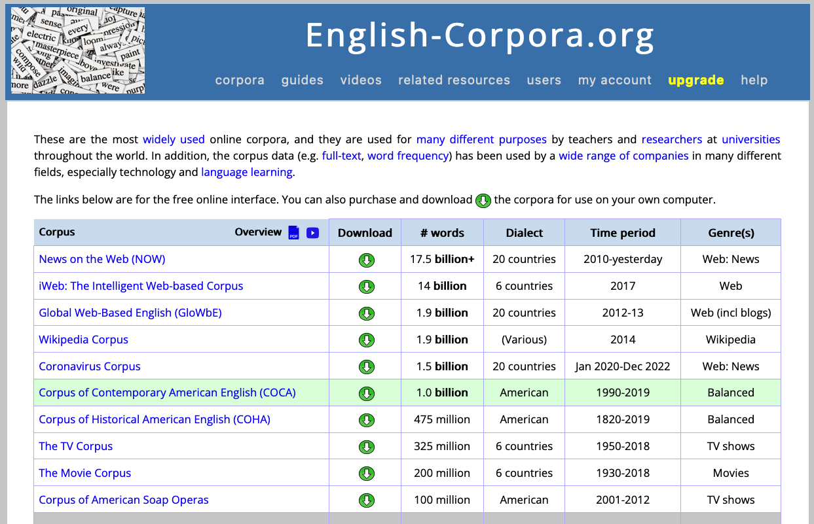

- **COHA**: Corpus of Historical American English: 400+ million words, 1820–2010, decade-by-decade analysis [@Davies2010CorpusHistorical]
- **COCA**: Corpus of Contemporary American English: 1+ billion words, 1990–present, text type categories [@Davies2008CorpusContemporary]
- **NOW**: News on the Web: 20+ billion words, 2010–present, 20 countries [@Davies2016CorpusNews]

## Views

### List view

{width="600"}

___

### Chart view

{width="600"}

___

## Query syntax

### Lexemes (all forms of a word)

{width="600"}

Use capital letters to search for all forms: `WALK` finds *walk*, *walks*, *walked*, *walking*

___

### Word classes

{width="600"}

___

{width="600"}

Common tags: `_nn` (noun), `_vv` (verb), `_jj` (adjective), `_rb` (adverb)

___

### Wildcards

- `*` matches any characters: `admin*` → *admin*, *administration*, *administrator*
- `?` matches single character: `wom?n` → *woman*, *women*

___

## Useful features

- **Sections**: Filter by text type (fiction, academic, spoken, etc.)
- **Chart**: Visualize frequency over time or across categories
- **KWIC**: View concordance lines (keyword in context)
- **Collocates**: Find words that frequently co-occur

# Practice: language change in progress

## Overview {.small}

Investigate language change in progress using the COHA.

**Phenomena**

1. *whom* vs *who*
2. *try to* vs *try and*
3. *have gotten* vs *have got*

**Task**

Collect your findings in this PowerPoint presentation: <https://1drv.ms/p/c/9a2ec97d593520f9/IQDU1gjOhJMBSqmABzQtcktWAZyTrvf_0zYOHERnCkdNSSk>.

1. Investigate the frequency over time in the COHA.
2. Compare frequency across text types in the COCA.
3. Compare frequency across countries in the NOW corpus.
4. Read concordance lines: do the forms differ with regards to their usage in different contexts?

## Group findings

1. What are your results?
2. What might explain these results?
3. How can we interpret them linguistically?

## Discussion

What general trends might explain these changes?

::: {.excl}
- **Informalization**: Spoken/informal features entering written language
- **Simplification**: Loss of case distinctions (*who/whom*)
- **Americanization**: American variants spreading (if comparing to British data)
- **Colloquialization**: Written language becoming more speech-like
:::

# References

:::: {#refs}
::::