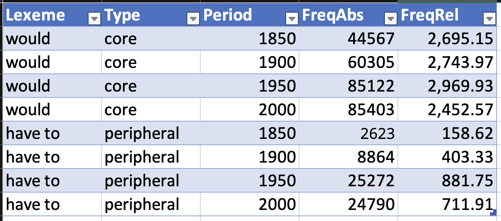
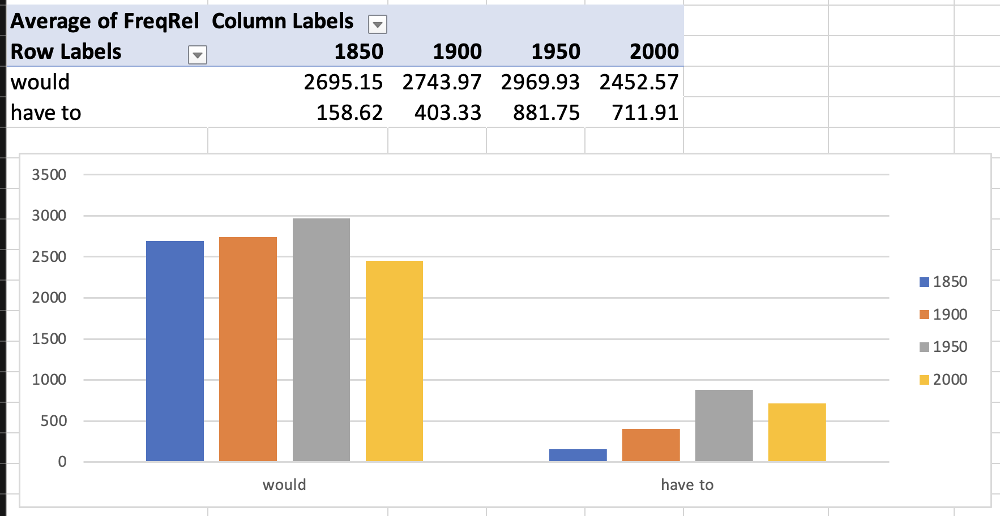
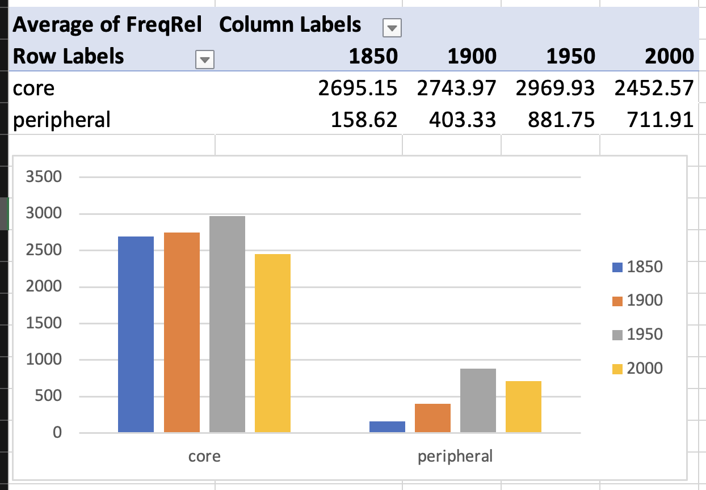
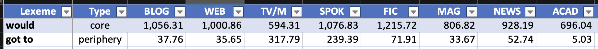
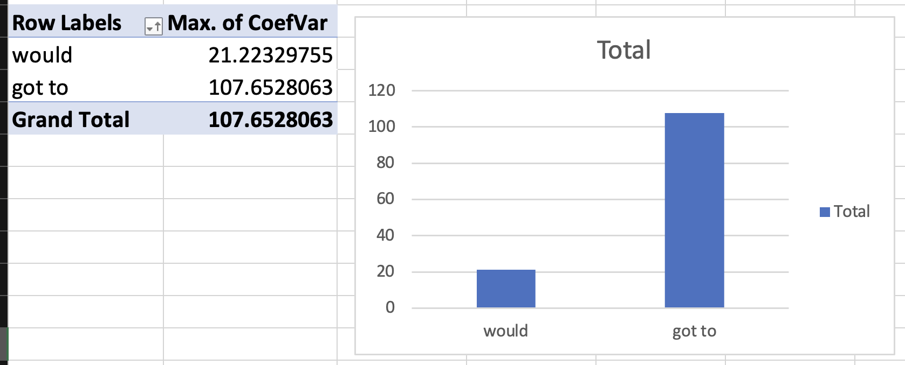
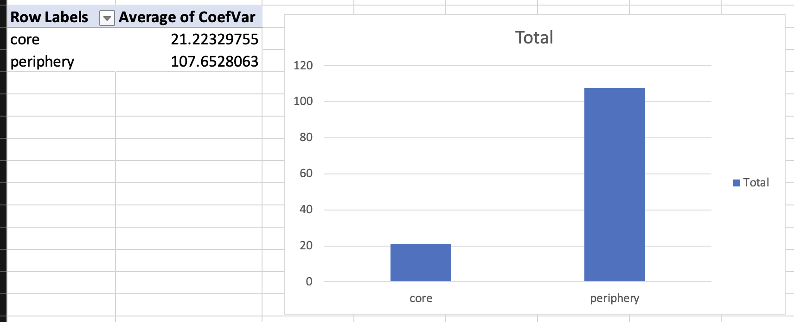

::: {.content-hidden when-format="revealjs"}
[open slides](slides.html){.btn .btn-primary} [download slides (pdf)](slides.pdf){.btn .btn-secondary}
:::

# @Hilpert2015Grammatical: Study questions

## 1. What are the three main types of grammatical change that Hilpert discusses, and can you give an example of each?

. . .

- **Grammaticalization**: New grammatical option emerges 
    - e.g., passive progressive *the meat is being cooked* alongside older *the meat is cooking*
- **Frequency change**: Statistical shifts without new forms 
    - e.g., *I haven't the time* declining vs. *I don't have the time* increasing
- **Style change**: Genre-confined fluctuations 
    - e.g., *shall* retracting to academic metalinguistic contexts: *as we shall see*

## 2. How do corpus design choices (balanced vs. single text type) affect what kinds of changes we can observe, and what are the advantages and limitations of each approach?

. . .

- **Balanced corpora** (Brown family): Compare across varieties/time; distinguish divergence, convergence, Americanization; but smaller per genre
- **Single text type** (Time corpus): More data within one genre; reveals genre-specific trends; but cannot separate grammatical change from style change
- Discrepancies between corpus types may reflect genuine genre-specific change or sampling error

## 3. How do lexical change (Session 10) and grammatical change (Hilpert) differ in how they manifest in corpus data, and how might the methods used to study each type differ?

. . .

- Grammatical change often manifests in **shifting relative frequencies** of co-existing forms, not just appearance/disappearance
- Point-wise comparison shows *that* change happened; corpus analysis reveals *how*, *when*, and *why*
- Methods: Multivariate regression analyzing conditioning factors (phonological, syntactic, social) and how their influence changes
- Systemic patterns (e.g., "great complement shift") require analyzing multiple phenomena together
    - e.g. *I dislike to do this* → *I dislike doing this*

## 4. How does understanding synchronic variation help us interpret diachronic change patterns, and what can corpus methods reveal about the relationship between variation and change?

. . .

- **Variation as seed of change**: Diachronic change proceeds through synchronic variation 
    - e.g., *writeth/hath/doth* vs. *writes/has/does* coexisting before *-s* wins
- **Conditioning factors shift**: Corpus methods reveal which factors govern variation at each stage (e.g., cross-gender effect only significant in period 3)
- **Entrenchment**: High-frequency forms resist change longest (*doth*, *hath* persisting)
- **Diagnostic**: Significant time × factor interactions signal genuine grammatical change

# Dimensions of variation

## Types of variation

::: {.fragment}
- **Diatopic**: Geographic/regional variation
- **Diastratic**: Social variation (class, education, age)
- **Diaphasic**: Situational variation (register, style)
:::

. . .

**Language change** = language variation over time = **diachronic variation**

---

**Variation based on "user" and "language use"**

![Dimensions of variation in English. [@Kortmann2020Essentials, p. 204]](att/image_1706633267124_0.png){height="400"}

# Speaker variation

## Regional variation in lexical innovation

![Mapping lexical innovation across regions [@Grieve2018MappingLexical]](att/lexical-innovation_1698948545880_0.png)

### Differences between British and American English {.slide}

::: {.fragment}
**Examples**:

| British  | American  |
|:---------|:----------|
| autumn   | fall      |
| lift     | elevator  |
| lorry    | truck     |
:::

# Speaker variation: social variation

## Sociolect

**Sociolect**: Social dialect - variation depending on education and social standing.

. . .

**Examples of social variation**:

. . .

- **Education level**: *ain't* vs *am not/is not/are not*
- **Social class**: *pardon* vs *what* vs *excuse me*
- **Age groups**: *cool* vs *awesome* vs *lit*
- **Professional jargon**: *Sprachwissenschaft* vs *Linguistik*

. . .

**Key principle**: Lexical choices often signal social identity and group membership.

# Situational variation: Register

## Register variation

::: {.fragment}
**Register**: Variation that depends on language use, not the user. Includes lexical, phonological, and grammatical features.
:::

. . .

**Examples**:

. . .

- **Academic**: *lexical item*, *corpus analysis*, *frequency distribution*
- **Informal**: *word*, *text study*, *how often*
- **Technical**: *morphological process*, *phonological rule*
- **Everyday**: *word formation*, *sound pattern*

. . .

**Key insight**: The same speaker uses different vocabulary in different situations.

# Case study: Modal verbs in English

## Lexical change and variation in English modal verbs

**Research foundation**: [@Hilpert2015Grammatical]

. . .

> "Another domain of English grammar that is currently undergoing change is the domain of modality, specifically the modal auxiliaries. In the most general of terms, the situation is that several of the core modal auxiliaries are declining in text frequency (Leech 2003; Mair 2006), while at the same time new quasi-modal elements are undergoing grammaticalization (Krug 2000)." [@Hilpert2015Grammatical, p. 185-186]

. . .

**Research questions**:

- Why are certain forms declining while others increase?
- Is there a relation between these developments?
- How do we assign cause and effect roles?

# Core and peripheral modals

:::: {.columns}
::::: {.column width="50%"}
**Core modals** 

::: {.fragment}
- *will*, *would*
- *can*, *could*
- *may*, *might*
- *shall*, *should*
- *must*
:::
:::::

::::: {.column width="50%"}
**Peripheral modals**

::: {.fragment}
- *BE going to*
- *have to*
- *got to*
- *need to*
:::
:::::
::::

. . .

**Pattern**: Core modals show frequency decline while peripheral modals show increase.

# Frequency changes over time

## Corpus evidence

**Brown family of corpora**: Brown (1961), LOB (1961), Frown (1992), FLOB (1992)

![Brown family of corpora structure. [@Hilpert2015Grammatical]](att/image_1706635726443_0.png)

___

> "Parallel cross-variety declines are particularly in evidence for the modals *would*, *may*, *should*, *must*, and *shall*." [@Hilpert2015Grammatical, p. 186]

**Declining core modals**: *would*, *may*, *should*, *must*, *shall*

. . .

**Increasing peripheral modals**: *BE going to*, *have to*, *got to*, *need to*

. . .

> "This is further corroborated by Hilpert (2008: 37), who finds that typical verbal collocates of *shall* in the British National Corpus are the explicitly metalinguistic verbs *consider*, *examine*, *discuss*, and *argue*. The decline of *shall* is thus to be seen as a retraction into a highly specific communicative genre." [@Hilpert2015Grammatical, p. 186-187]

# Text type variation

## Genre-specific patterns

> "In a study that is based on the Time magazine corpus (Davies 2007), Millar (2009) tracks the frequency of the modal auxiliaries in American English press writing. He finds that *shall*, *must*, and *ought* are declining between the 1920s and the 2000s, but that interestingly, *can*, *could*, and *may* are undergoing substantial frequency increases and *will*, *might*, and *should* show at least small increases (Millar 2009: 205)." [@Hilpert2015Grammatical, p. 187]

. . .

**Time magazine corpus analysis** (Millar 2009):

- *shall*, *must*, *ought* declining (1920s-2000s)
- *can*, *could*, *may* increasing substantially
- *will*, *might*, *should* showing small increases

---

> "One explanation for the discrepancies between the tendencies in the Brown family of corpora and in the Time corpus is the composition of the respective corpora. Whereas the Brown corpora represent a balanced set of genres, the Time corpus represents a single text type." [@Hilpert2015Grammatical, p. 187]

. . .

**Key finding**: Text type variation can explain frequency discrepancies across different corpora.

# Practice: Corpus analysis of modal verbs

## Collaborative analysis

**Microsoft Excel spreadsheet**: <https://1drv.ms/x/c/9a2ec97d593520f9/EezC1WmhjPNEiVR-eERIIU8BdRV5kbqEGw-17MMMJAr2gQ>

. . .

**Task 1**: Study modal verb frequency changes in COHA

**Search queries**:

| Core | Peripheral |
|------------------------------------|------------------------------------|
| `would *_vv`                       | `BE going to *_vv`                 |
| `may *_vv`                         | `HAVE to *_vv`                     |
| `should *_vv`                      | `got to *_vv`                      |
| `must *_vv`                        | `NEED to *_vv`                     |
| `shall *_vv`                       |                                    |

___

**Time intervals**: 1850, 1900, 1950, 2000

# Practice: Frequency analysis

## Individual modal analysis

. . .

## Group analysis

# Practice: Text type specificity

## Coefficient of Variation (CV)

**Definition**: Statistical measure of relative variability.

$$
\begin{align}
CV &= \frac{\sigma}{\mu} \times 100 \\
&= \frac{\text{Standard Deviation}}{\text{Mean}} \times 100
\end{align}
$$

. . .

**Application**: Measures variability of word frequencies across different text types.

---

**Excel calculation**:

1. Calculate mean: `=AVERAGE(A1:A10)`
2. Calculate standard deviation: `=STDEV.S(A1:A10)`
3. Calculate CV: `=(B2/B1)*100`

# Practice: Text type results

## Individual modal differences

. . .

## Group differences

. . .

**Key finding**: Core modals show higher text type specificity (higher CV) than peripheral modals.

# Summary

## Summary

**General takeaways**:

- **Variation is fundamental**: Lexical variation occurs across multiple dimensions
- **Speaker variation**: Regional (dialect) and social (sociolect) differences
- **Situational variation**: Register differences based on context and use

. . .

**Modal verbs**:

- **Diachronic patterns**: Modal verbs show systematic frequency changes over time
- **Text type specificity**: Different modals show varying degrees of genre preference
- **Corpus methods**: Quantitative analysis reveals patterns not visible through intuition alone

# References

:::: {#refs}
::::